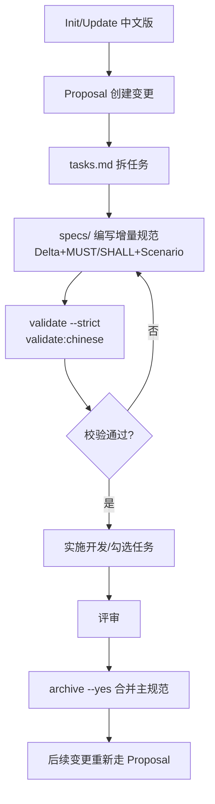

# OpenSpec 中文版快速上手与规范要点

## 1. 环境与安装

- 需要 Node.js ≥ 20.19.0（项目本身使用 Node 22 也兼容）。
- 全局安装（推荐）：`pnpm install -g @org-hex/openspec-chinese@latest`。
- 本地开发/调试：克隆仓库后 `pnpm install && pnpm run build`，可用 `npm link` 暂时全局使用。
- 常用校验：`openspec-chinese --version`、`openspec-chinese --help`。

## 2. 在全新项目内初始化 OpenSpec

- 进入目标项目根目录执行：`openspec-chinese init`。
- 如需一次性调用（不全局安装），可用：`pnpm dlx @org-hex/openspec-chinese init`。
- 初始化后如果 IDE 里斜杠命令未出现，重启 IDE/AI 编程工具。
- 生成的核心结构：

```plain
openspec/
├── project.md      # 项目上下文
├── AGENTS.md       # AI 助手指令
├── specs/          # 现行规范（事实）
└── changes/        # 变更提案（建议）
```

## 3. 在现有 OpenSpec 配置中新增或迭代规格

- 若原本使用英文版，直接在项目根目录执行 `openspec-chinese update` 即切换中文界面并保持兼容。
- 创建新提案：`openspec-chinese proposal "功能描述"`，或在 AI 工具中用对应斜杠命令（如 Cursor `/openspec-proposal`）。
- 提案目录约定：`openspec/changes/<change-name>/`，包含 `proposal.md`（Why/What/Impact）、`tasks.md`（实施清单）、`specs/`（增量规范）。
- 迭代流程建议：撰写提案 → 补充 tasks → 在 `specs/` 编写增量规范 → `openspec-chinese validate <change> --strict` → 完成后 `openspec-chinese archive <change> --yes` 合并入主规范。

## 4. OpenSpec-Chinese 新增规格的固定格式规则

- Delta 分区必填：使用英文标题 `## ADDED Requirements`、`## MODIFIED Requirements`、`## REMOVED Requirements`。
- Requirement 语句需包含 MUST/SHALL 等强制关键词，示例：`系统 MUST 提供用户搜索功能。`
- 场景采用英文 Gherkin 关键字：`#### Scenario: ...`，并使用 `WHEN` / `THEN` / `AND`（关键字英文，描述可中文）。
- 保持段落层级：Requirement 之下放对应 Scenario；删除需求时附上 Reason/Migration。
- 混合中英标点时，确保关键字和节标题使用英文，内容描述可中文。
- 推荐用 `npm run validate:chinese` 进行中文格式额外校验（检查 MUST/SHALL、Delta 分区、Scenario 语法等）。

## 5. 常用命令速查

- 初始化：`openspec-chinese init`
- 创建提案：`openspec-chinese proposal "xxx"` 或 `/openspec-proposal`
- 查看变更列表：`openspec-chinese list`
- 查看详情：`openspec-chinese show <change>`
- 校验格式：`openspec-chinese validate <change> --strict`；中文专检：`npm run validate:chinese`
- 归档变更：`openspec-chinese archive <change> --yes`
- 升级/刷新 AI 配置：`openspec-chinese update`

## 6. 常见问题与排查提示

- 命令不可用：确认全局安装或 `npm link` 是否生效，并检查 npm 全局 bin 是否在 PATH；可重装或重连。
- 斜杠命令未刷新：执行 `openspec-chinese update` 或重启 IDE。
- 校验报错常见原因：缺少 MUST/SHALL、Scenario 层级错误、未填写 Delta 分区、Gherkin 关键字使用中文。
- 需要回到英文版：在项目根目录执行 `openspec update`（与中文版兼容）。

## 7. 自定义模板与示例 spec.md 骨架

- 自定义模板存放建议：`openspec/templates/`，新需求时复制到 `openspec/changes/<change>/specs/` 再填充。
- 模板要点：保持 Delta 分区英文标题；Requirement 使用 MUST/SHALL；Scenario 使用英文 Gherkin 关键字（WHEN/THEN/AND），描述可中文。
- 示例骨架：

```markdown
## ADDED Requirements

### Requirement: <能力名称>

系统 MUST 提供 <能力描述>。

#### Scenario: <场景 1>

- **WHEN** <前置条件>
- **THEN** <预期结果>

#### Scenario: <场景 2>

- **WHEN** <前置条件>
- **THEN** <预期结果>

## MODIFIED Requirements

### Requirement: <被修改的能力>

- 变化说明：...

## REMOVED Requirements

### Requirement: <被移除的能力>

- Reason: ...
- Migration: ...
```

## 8. 规格全生命周期流程

- 创建：`openspec-chinese proposal "功能"` 或 `pnpm dlx @org-hex/openspec-chinese proposal "功能"`。
- 细化：在 `tasks.md` 拆任务；在 `specs/` 按模板写增量规范。
- 校验：`openspec-chinese validate <change> --strict` 和 `npm run validate:chinese`。
- 实施：按任务推进，必要时补充 `design.md`，同步勾选任务。
- 合并：评审后 `openspec-chinese archive <change> --yes`，规范入主库。



## 9. 用 AI 模型补全生成的 `openspec/project.md` 文件

在生成完 `openspec/project.md` 文件后，应该向大模型提出以下要求，并要求大模型补全完善 `openspec/project.md` 文档。

```markdown
1. 填充您的项目上下文:
   "请阅读 openspec/project.md 并帮助我填写
   关于我的项目、技术栈和约定的详细信息"
```
