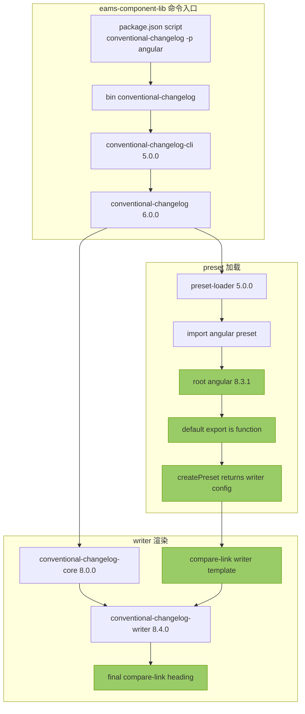
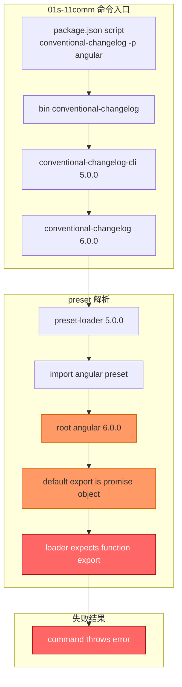
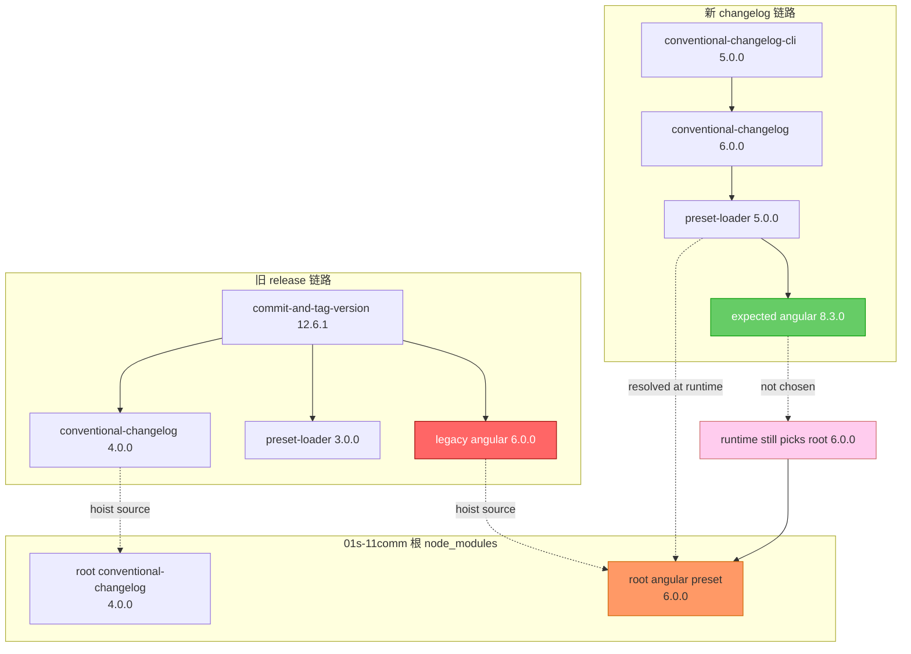
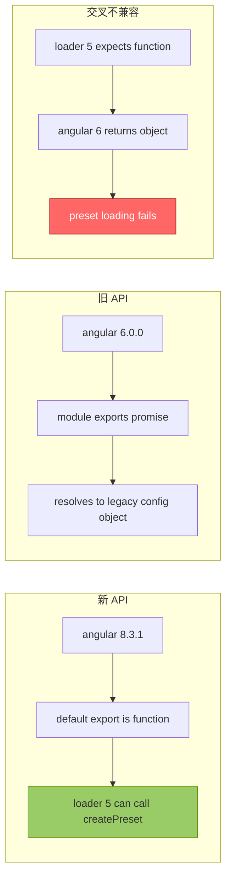
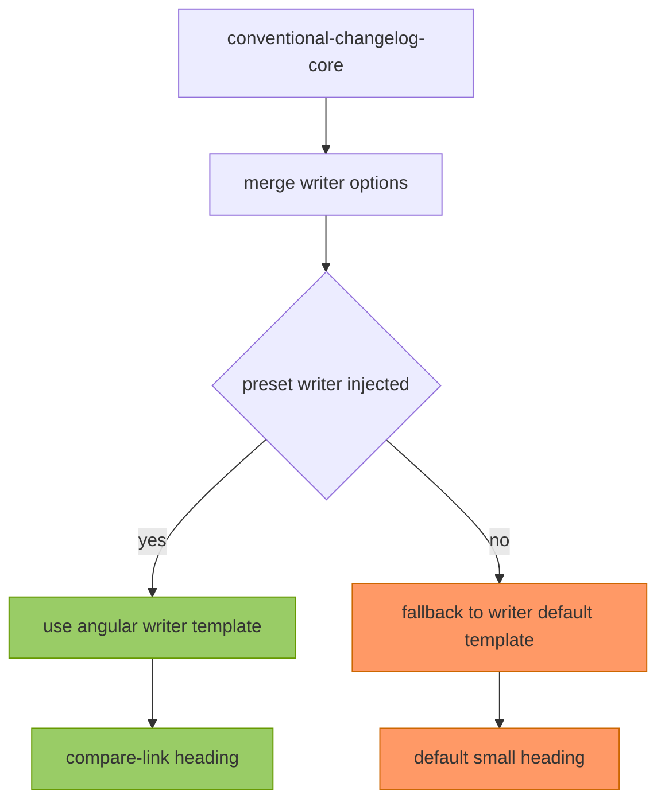
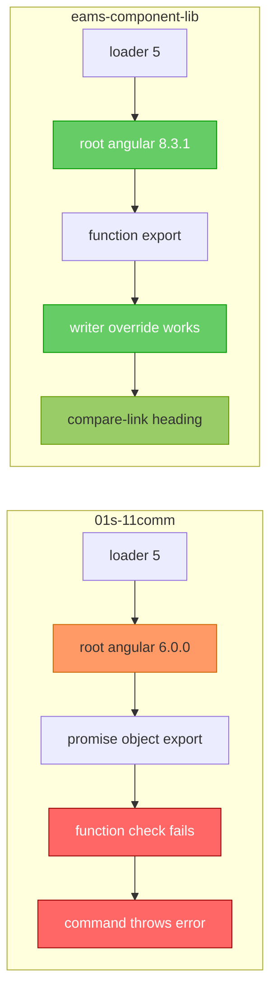

<!-- 有价值的报告 不予删除 -->

# 2026-04-09 conventional-changelog angular loader 依赖识别联调报告

## 执行摘要

本次联调的核心结论不是“两个仓库都在用同一个 `angular preset`，只是表现不同”，而是：

- `D:\code\store\eams-component-lib` 当前 `pnpm run changelog:conventional-changelog` 实际命中的是 `conventional-changelog-angular@8.3.1`
- `D:\code\ruan-cat\01s-11comm` 当前同名脚本在 `conventional-changelog-cli@5` 链路下，最终命中的却是 `conventional-changelog-angular@6.0.0`
- `conventional-changelog-angular@8.3.1` 导出的是函数，满足 `conventional-changelog-preset-loader@5` 的加载契约，因此可以成功注入 `writer` 模板，生成 compare-link 标题
- `conventional-changelog-angular@6.0.0` 导出的不是函数，而是一个 `Promise -> 配置对象` 的旧形态，不满足 `loader@5` 的新契约，因此在 `01s-11comm` 中直接报错：`The "angular" preset does not export a function`
- `<small>` 标题不是 `angular@6.0.0` 提供的模板，而是 `conventional-changelog-writer` 的默认 header 模板

一句话总结：

`eams-component-lib` 是“新 loader + 新 angular preset”，所以能覆盖默认模板并输出 compare-link；`01s-11comm` 是“新 loader 撞上旧 angular preset”，所以当前命令无法成功加载 preset。

## 调查对象

- 仓库 A：`D:\code\store\eams-component-lib`
- 仓库 B：`D:\code\ruan-cat\01s-11comm`
- 关注命令：`pnpm run changelog:conventional-changelog`
- 关注脚本：`conventional-changelog -p angular -i CHANGELOG.md -s`

## 调查方法

本次没有只看 `package.json`，而是同时检查了以下层级：

- 根脚本实际调用的 `.bin/conventional-changelog`
- `conventional-changelog-cli` 私有依赖链
- `conventional-changelog@6` 对 `conventional-changelog-preset-loader` 的调用方式
- `loader` 在两个仓库中各自实际解析到的 `conventional-changelog-angular` 物理包
- `angular@8.3.1` 与 `angular@6.0.0` 的导出形态差异
- `conventional-changelog-core` 与 `conventional-changelog-writer` 的模板合并逻辑

## 完整链路清单

### 链路 1：eams-component-lib 当前生效链路

`pnpm run changelog:conventional-changelog`
-> `node_modules/.bin/conventional-changelog`
-> `conventional-changelog-cli@5.0.0`
-> `conventional-changelog@6.0.0`
-> `conventional-changelog-preset-loader@5.0.0`
-> `import('conventional-changelog-angular')`
-> `root node_modules/conventional-changelog-angular@8.3.1`
-> `default export function createPreset`
-> 返回 `{ commits, parser, writer, whatBump }`
-> `conventional-changelog-core@8.0.0` 合并 `config.writer`
-> `conventional-changelog-writer@8.4.0`
-> compare-link 标题

### 链路 2：01s-11comm 当前脚本实际失败链路

`pnpm run changelog:conventional-changelog`
-> `node_modules/.bin/conventional-changelog`
-> `conventional-changelog-cli@5.0.0`
-> `conventional-changelog@6.0.0`
-> `conventional-changelog-preset-loader@5.0.0`
-> `import('conventional-changelog-angular')`
-> `root node_modules/conventional-changelog-angular@6.0.0`
-> `default export Promise / object`
-> 不满足 `loader@5` 需要的函数导出
-> 抛出 `does not export a function`

### 链路 3：01s-11comm 中引入 angular@6.0.0 的旧链路

`commit-and-tag-version@12.6.1`
-> `conventional-changelog@4.0.0`
-> `conventional-changelog-preset-loader@3.0.0`
-> `conventional-changelog-angular@6.0.0`

## 仓库 A：eams-component-lib 的成功链路

### 结果

`eams-component-lib` 当前的 changelog 命令可以正常加载 `angular` preset，并成功覆盖 writer 默认模板，最终输出 compare-link 标题。

### 依赖链路图



### 关键点

- `conventional-changelog@6` 会先调用 `loadPreset('angular')`
- `loader@5` 在该仓库中解析到的是 `root node_modules/conventional-changelog-angular@8.3.1`
- `angular@8.3.1` 的入口导出函数，满足 `loader@5` 的期望
- 该函数返回的 `writer` 配置会覆盖 `conventional-changelog-writer` 默认模板
- 因此最终标题来自 `angular` 模板，而不是 writer 默认 `<small>`

## 仓库 B：01s-11comm 的失败链路

### 结果

`01s-11comm` 当前同名脚本并没有成功加载 `angular` preset。当前 fresh install 环境下执行：

```bash
pnpm exec conventional-changelog -p angular -r 1 -v
```

会直接报错：

```text
Error: The "angular" preset does not export a function. Maybe you are using an old version of the preset. Please upgrade.
```

### 当前失败链路图



### 关键点

- `01s-11comm` 同时存在两代链路：
  - 新链：`conventional-changelog-cli@5 -> conventional-changelog@6 -> loader@5`
  - 旧链：`commit-and-tag-version@12.6.1 -> conventional-changelog@4 -> loader@3 -> angular@6`
- 当前命令虽然是通过 CLI5 进入 `conventional-changelog@6`
- 但是 `loader@5` 在该仓库里做 `import('conventional-changelog-angular')` 时，最终命中的是根目录的 `angular@6.0.0`
- `angular@6.0.0` 不是“函数导出型 preset”，因此不符合 `loader@5` 的新接口要求

## 旧链路为什么会干扰新链路

### 01s-11comm 的包图混装现象



### 解释

这个仓库的问题不是“没有装 `angular@8`”，而是“`loader@5` 最终没有命中 `angular@8`”。

更准确地说：

- `conventional-changelog@6` 自己私有依赖里的 `loader` 确实是 `5.0.0`
- 但 `loader@5` 里面使用的是 `import('conventional-changelog-angular')`
- 这个 bare specifier 的解析结果会向上命中仓库根的 `node_modules/conventional-changelog-angular`
- 而 `01s-11comm` 根目录的这个包当前指向的是 `6.0.0`
- 所以新链路并没有得到新式 `angular` preset，而是拿到了旧式 `angular@6`

## angular@8.3.1 与 angular@6.0.0 的导出差异

### 对比图



### 语义差异

`angular@8.3.1`：

- 入口导出一个函数
- `loader@5` 调用 `createPreset()` 后得到 `writer` 配置
- 能被 `conventional-changelog@6` 正常消费

`angular@6.0.0`：

- 入口导出的是一个 `Promise`
- Promise resolve 之后才得到旧结构配置对象
- 这种导出形态是为旧链路准备的，不符合 `loader@5` 的函数契约

## 为什么 `<small>` 不是 angular@6.0.0 提供的

### 默认 writer 模板

`conventional-changelog-writer` 的默认 header 模板内置了 `<small>`：



### 本次调查结论

- `<small>` 来自 `conventional-changelog-writer` 默认模板
- compare-link 来自 `angular` preset 返回的 `writer` 模板
- `angular@6.0.0` 自己的 header 模板也已经是 compare-link 风格，不是 `<small>`
- `01s-11comm` 当前脚本下的关键问题不是“加载成功但模板不同”，而是“当前 loader 根本没有成功加载 preset”

## 两仓联调对照图



## 证据摘要

### eams-component-lib

- 当前脚本链路实际命中 `conventional-changelog-angular@8.3.1`
- `loader@5` 在该仓库中可正常执行 `loadPreset('angular')`
- 当前 `CHANGELOG.md` 顶部是 compare-link 标题

### 01s-11comm

- `pnpm why conventional-changelog-preset-loader` 显示同时存在 `3.0.0` 和 `5.0.0`
- 根 `node_modules/conventional-changelog-angular` 指向 `6.0.0`
- `loader@5` 在该仓库里执行 `loadPreset('angular')` 会抛出 `does not export a function`
- 当前 `pnpm exec conventional-changelog -p angular -r 1 -v` 无法复现成功输出

## 最终结论

本次差异的根因可以归纳为三句话：

1. `conventional-changelog-writer` 一直都会参与渲染，但只有在 preset 成功加载后，默认 `<small>` 模板才会被覆盖。
2. `eams-component-lib` 当前命中了 `angular@8.3.1`，所以 preset 成功加载，writer 被覆盖，得到 compare-link。
3. `01s-11comm` 当前命中了 `angular@6.0.0`，而 `loader@5` 只接受函数导出型 preset，因此当前命令直接失败，根本走不到 compare-link 覆盖阶段。

## 建议

- 如果要让 `01s-11comm` 的当前 changelog 脚本恢复可复现，应先消除根 `node_modules` 中 `angular@6.0.0` 对 `loader@5` 的命中影响
- 如果继续保留 `commit-and-tag-version@12.6.1` 旧链路，就需要明确隔离它与 `conventional-changelog-cli@5` 新链路的 preset 解析结果
- 如果目标是统一两仓行为，最稳妥的方向是统一到同一代 `conventional-changelog` / `preset-loader` / `angular preset` 组合
