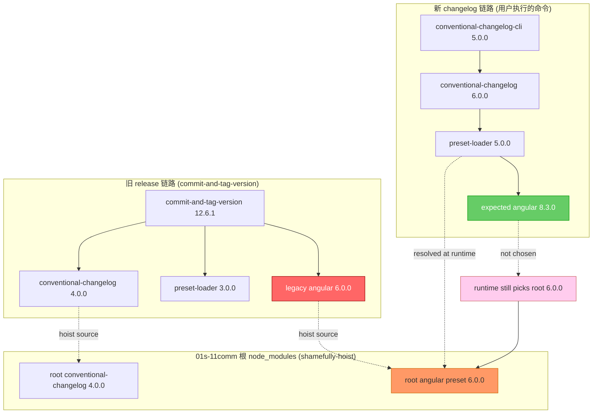
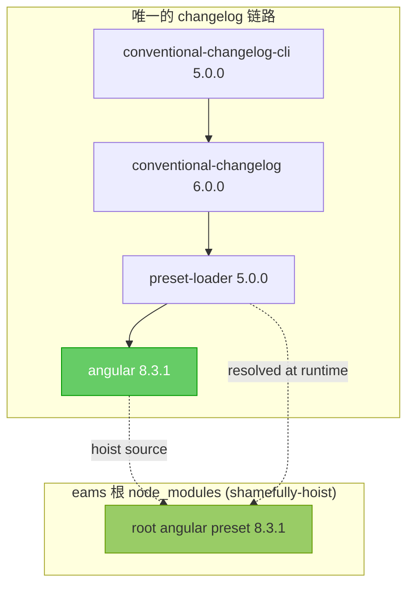
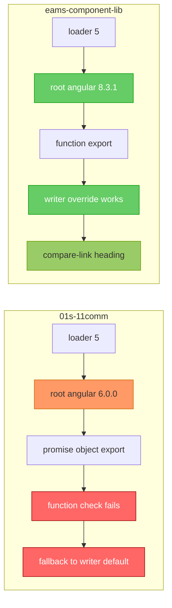
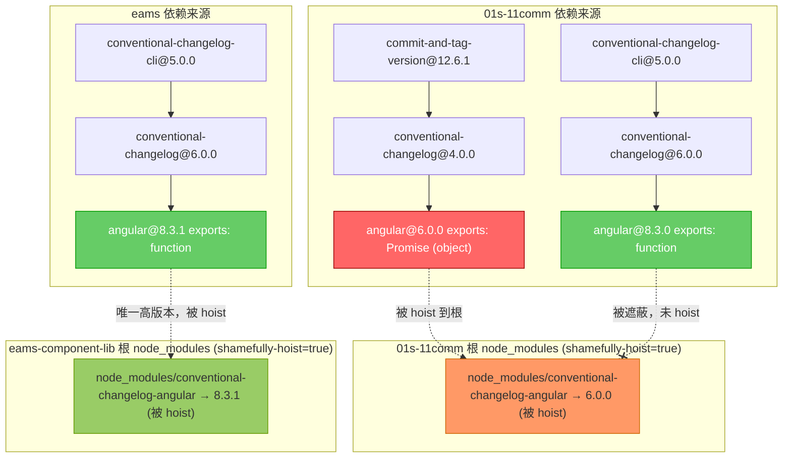
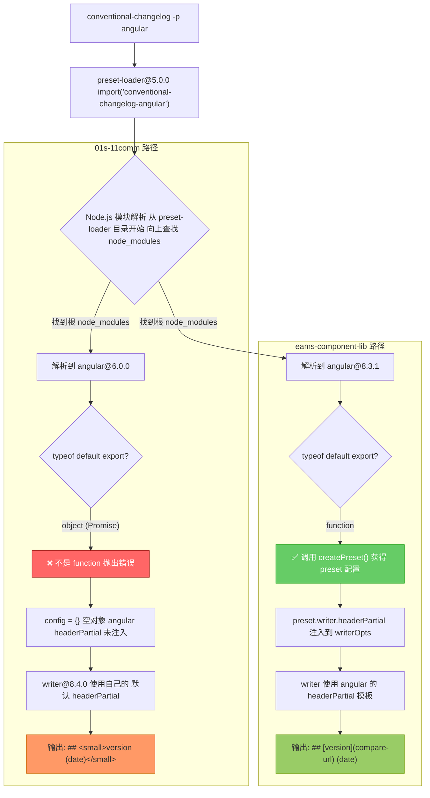
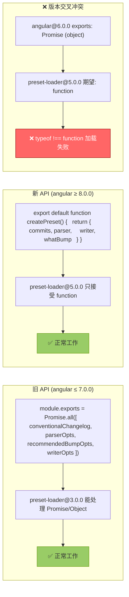

<!-- 有价值的报告 不予删除 -->

# conventional-changelog-angular 版本冲突导致 CHANGELOG 格式差异分析

## 问题现象

两个项目使用完全相同的命令生成 CHANGELOG：

```bash
conventional-changelog -p angular -i CHANGELOG.md -s
```

但产出的标题格式完全不同：

| 项目                 | 实际输出                                                                  |
| -------------------- | ------------------------------------------------------------------------- |
| `01s-11comm`         | `## <small>0.11.3 (2026-04-09)</small>`                                   |
| `eams-component-lib` | `## [1.0.7](https://github.com/.../compare/v1.0.6...v1.0.7) (2026-04-09)` |

## 根因结论

`<small>` 标签**不来自任何版本的 `conventional-changelog-angular`**。所有版本（6.0.0、7.0.0、8.3.0、8.3.1）的 `headerPartial` 模板完全相同，都是 link 链接格式。

`<small>` 来自 `conventional-changelog-writer` 包的**内置默认 fallback 模板**，在 angular preset 加载失败时被启用。

失败原因：pnpm `shamefully-hoist=true` 将旧版 `angular@6.0.0`（由 `commit-and-tag-version` 引入）提升到根 `node_modules`，遮蔽了 CLI 实际需要的 `angular@8.3.0`。新版 preset-loader 无法识别旧版 API，导致 preset 静默加载失败。

## 两个项目的完整依赖链路

### 01s-11comm 依赖树

```plain
@01s-11comm/root@0.11.3
│
├─ @01s-11comm/admin (workspace link)
│  └─ @commitlint/cli@19.8.1
│     └─ @commitlint/parse@19.8.1
│        └─ conventional-changelog-angular@7.0.0
│
├─ commit-and-tag-version@12.6.1          ← 引入旧版 angular 的元凶
│  ├─ conventional-changelog@4.0.0
│  │  ├─ conventional-changelog-angular@6.0.0    ← 旧版！被 hoist 到根
│  │  ├─ conventional-changelog-core@5.0.2
│  │  │  └─ conventional-changelog-writer@6.0.1
│  │  └─ conventional-changelog-preset-loader@3.0.0
│  └─ conventional-recommended-bump@7.0.1
│     └─ conventional-changelog-preset-loader@3.0.0
│
├─ commitlint@20.5.0
│  └─ @commitlint/cli@20.5.0
│     └─ @commitlint/parse@20.5.0
│        └─ conventional-changelog-angular@8.3.0
│
└─ conventional-changelog-cli@5.0.0       ← 用户执行的命令入口
   └─ conventional-changelog@6.0.0
      ├─ conventional-changelog-angular@8.3.0    ← 期望使用的版本
      ├─ conventional-changelog-core@8.0.0
      │  └─ conventional-changelog-writer@8.4.0  ← <small> 默认模板在这里
      └─ conventional-changelog-preset-loader@5.0.0
```

### eams-component-lib 依赖树

```plain
@eams-monorepo/root@1.0.7
│
├─ @commitlint/cli@19.8.1
│  └─ @commitlint/parse@19.8.1
│     └─ conventional-changelog-angular@7.0.0
│
└─ conventional-changelog-cli@5.0.0       ← 用户执行的命令入口
   └─ conventional-changelog@6.0.0
      ├─ conventional-changelog-angular@8.3.1    ← 唯一的高版本，被 hoist 到根
      ├─ conventional-changelog-core@8.0.0
      │  └─ conventional-changelog-writer@8.4.0
      └─ conventional-changelog-preset-loader@5.0.0
```

## 01s-11comm 的包混装现象

### 新旧链路交叉污染

`01s-11comm` 的核心问题不是"没有装 `angular@8`"，而是"装了但 `loader@5` 运行时没命中它"。

仓库中同时存在两代 changelog 链路：

- **新链路**：`conventional-changelog-cli@5` → `conventional-changelog@6` → `loader@5` → 期望 `angular@8.3.0`
- **旧链路**：`commit-and-tag-version@12.6.1` → `conventional-changelog@4` → `loader@3` → `angular@6.0.0`

旧链路的 `angular@6.0.0` 被 pnpm `shamefully-hoist` 提升到根 `node_modules`，新链路的 `loader@5` 在运行时 `import('conventional-changelog-angular')` 向上解析，命中了根目录的旧版本。

### 包混装关系图



### 逐步解读

1. **旧链路提供 hoist 源**：`commit-and-tag-version@12.6.1` 依赖 `conventional-changelog@4.0.0`，后者再依赖 `conventional-changelog-angular@6.0.0`。由于 `shamefully-hoist=true`，`angular@6.0.0` 被提升到根 `node_modules/conventional-changelog-angular`
2. **新链路期望使用 angular@8.3.0**：`conventional-changelog-cli@5` → `conventional-changelog@6` → `angular@8.3.0` 存在于 pnpm 的 `.pnpm` 虚拟存储中，但未被提升到根
3. **运行时解析指向旧版**：`preset-loader@5.0.0` 执行 `import('conventional-changelog-angular')` 时，Node.js 模块解析从 `preset-loader` 的物理路径向上查找 `node_modules`，最终命中根目录的 `angular@6.0.0`
4. **API 不兼容**：`angular@6.0.0` 导出 Promise（object），`loader@5.0.0` 要求 function，类型检查失败

### eams-component-lib 为什么没有此问题



`eams-component-lib` 没有安装 `commit-and-tag-version`，不存在旧链路。唯一的 `angular` 来源是 `conventional-changelog@6.0.0` 依赖的 `angular@8.3.1`，它被正确 hoist 到根，`loader@5` 运行时命中的就是它——新 loader + 新 preset，API 兼容，加载成功。

### 两仓对照



## Mermaid 流程图：依赖解析与加载对比

### 图 1：两个项目的 angular 版本 hoist 对比



### 图 2：preset-loader 加载流程与失败路径



### 图 3：API 版本断代详解



## 三个 headerPartial 模板对比

### angular 的 headerPartial（所有版本相同，6.0.0 / 7.0.0 / 8.3.x）

```text
{{#if isPatch~}}
	##
{{~else~}}
	#
{{~/if}}
{{#if @root.linkCompare~}}
	[{{version}}](
	{{~#if @root.repository~}}
		{{~#if @root.host}}
			{{~@root.host}}/
		{{~/if}}
		{{~#if @root.owner}}
			{{~@root.owner}}/
		{{~/if}}
		{{~@root.repository}}
	{{~else}}
		{{~@root.repoUrl}}
	{{~/if~}}
	/compare/{{previousTag}}...{{currentTag}})
{{~else}}
	{{~version}}
{{~/if}}
{{~#if title}}
	"{{title}}"
{{~/if}}
{{~#if date}}
	({{date}})
{{/if}}
```

渲染结果：`## [1.0.7](https://github.com/.../compare/v1.0.6...v1.0.7) (2026-04-09)`

### writer@8.4.0 的默认 headerPartial（fallback 模板）

```text
## {{#if isPatch~}} <small>
  {{~/if~}} {{version}}
  {{~#if title}} "{{title}}"
  {{~/if~}}
  {{~#if date}} ({{date}})
  {{~/if~}}
  {{~#if isPatch~}} </small>
  {{~/if}}
```

渲染结果：`## <small>0.11.3 (2026-04-09)</small>`

### 对比要点

| 特征              | angular headerPartial              | writer 默认 headerPartial |
| ----------------- | ---------------------------------- | ------------------------- |
| patch 版本标记    | `##`（h2）                         | `## <small>...</small>`   |
| 非 patch 版本标记 | `#`（h1）                          | `##`（始终 h2）           |
| 版本号格式        | `[version](compare-url)` link 链接 | 纯文本 `version`          |
| `<small>` 标签    | 无                                 | patch 版本时包裹          |
| commit 分组标题   | 有（Features / Bug Fixes 等）      | 无                        |

## 实验验证结果

在两个项目根目录分别执行：

```bash
node --input-type=module -e "
  const m = await import('conventional-changelog-angular');
  console.log(typeof m.default);
"
```

| 项目                 | 解析到的版本    | `typeof m.default` | preset 加载结果 |
| -------------------- | --------------- | ------------------ | --------------- |
| `01s-11comm`         | `angular@6.0.0` | `object`           | ❌ 失败         |
| `eams-component-lib` | `angular@8.3.1` | `function`         | ✅ 成功         |

## 修复建议

### 方案 A：移除 commit-and-tag-version

当前项目已使用 `bumpp` + `relizy` 作为发版方案，`commit-and-tag-version` 已不再使用：

```bash
pnpm remove commit-and-tag-version -w
```

移除后，`angular@6.0.0` 不再存在于依赖树中，pnpm 会将 `angular@8.3.0` 正确 hoist 到根目录。

### 方案 B：使用 pnpm overrides 强制版本

在根 `package.json` 中添加：

```json
{
	"pnpm": {
		"overrides": {
			"conventional-changelog-angular": "^8.3.0"
		}
	}
}
```

强制所有依赖树中的 `conventional-changelog-angular` 使用 `8.x` 版本。

### 推荐

方案 A 更彻底 —— 移除已废弃的工具，消除依赖冲突根源。
