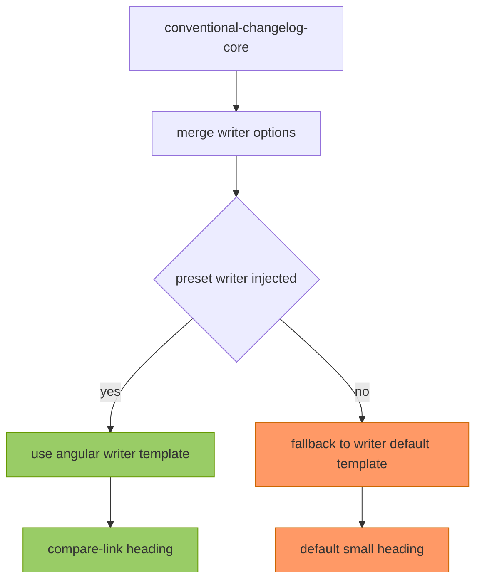
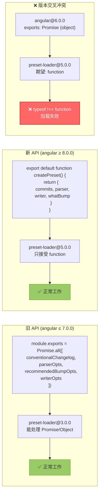
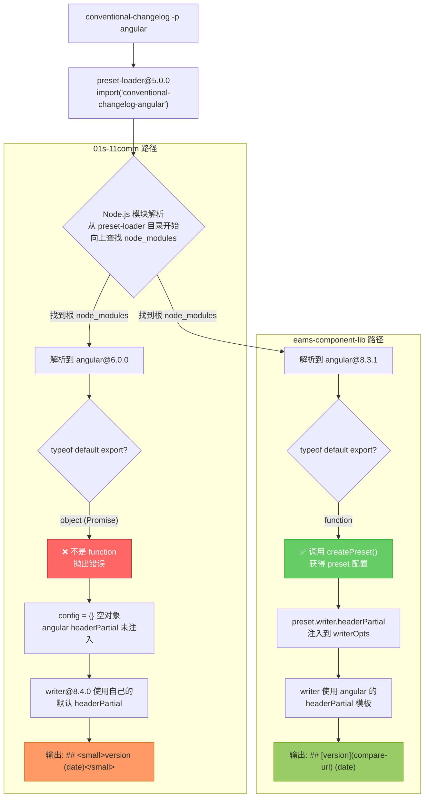
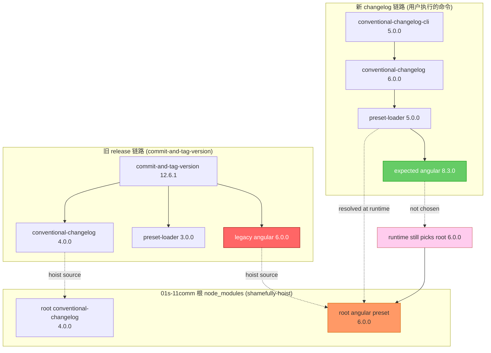
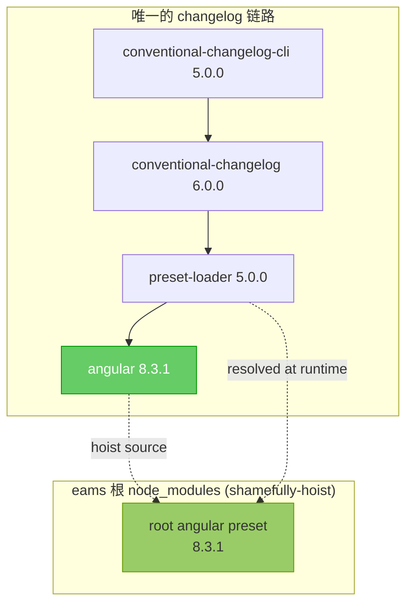
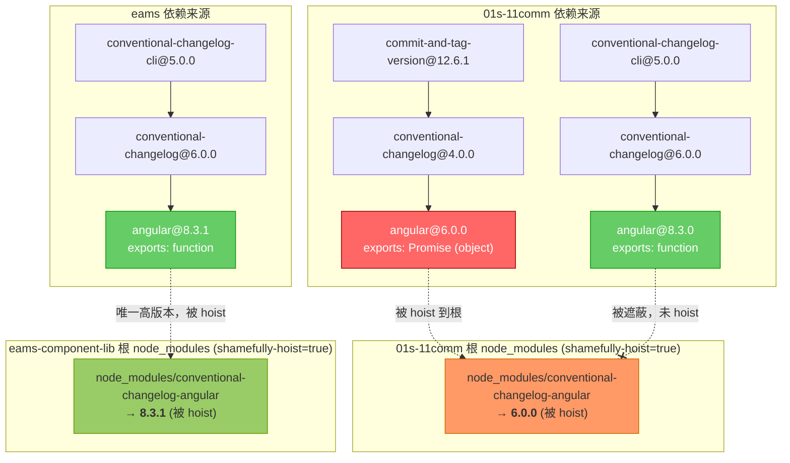
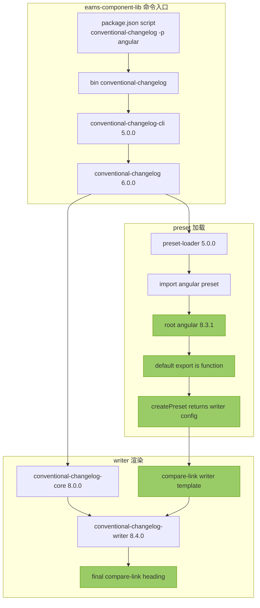
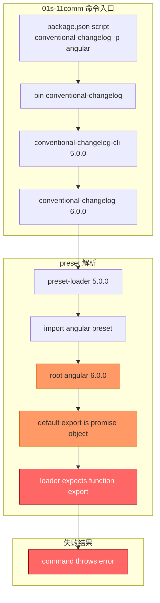
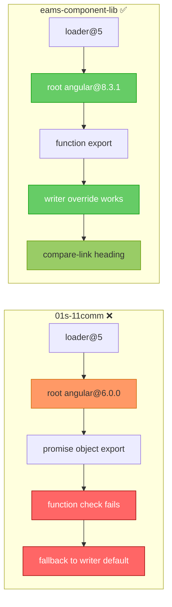

# pnpm 依赖提升踩坑：commit-and-tag-version 锁死旧版依赖引发的 CHANGELOG 格式异变

> **摘要**：
>
> 两个项目使用完全相同的 `conventional-changelog -p angular` 命令生成 CHANGELOG，一个输出正常的 `[version](compare-url)` 链接标题，另一个却退化为丑陋的 `<small>version</small>` 纯文本格式。
> 排查发现根因是 [commit-and-tag-version](https://github.com/absolute-version/commit-and-tag-version) 在 `package.json` 中将 `conventional-changelog` **锁死在 `4.0.0`**（不带 `^`），导致其子依赖 `conventional-changelog-angular@6.0.0` 被 pnpm 的 `shamefully-hoist` 提升到根 `node_modules`，遮蔽了新链路需要的 `angular@8.3.0`。
> 新版 `preset-loader@5` 加载到旧版 `angular@6` 后因 API 不兼容而静默失败，最终回退到 `conventional-changelog-writer` 的默认 `<small>` 模板。
> 本文完整记录了从发现差异、定位误解、锁定根因到最终修复的全过程。

> **AI 协助编写的博客文章**：
>
> 这篇文章有参与 AI 协助的。使用了 AI 润色文章。

## 1. 从两份 CHANGELOG 的格式差异说起

最近我在同时维护两个 monorepo 项目：`01s-11comm` 和 `eams-component-lib`。两个项目都接入了 [relizy](https://github.com/unjs/changelogen) + [bumpp](https://github.com/antfu-collective/bumpp) 的发版工作流，并且都保留了一条 `conventional-changelog -p angular -i CHANGELOG.md -s` 的脚本用来生成根级 CHANGELOG。

某天我在对比两个项目的 CHANGELOG 时，发现了一个诡异的差异。

**`eams-component-lib` 的 CHANGELOG 标题**——正常的 compare-link 格式：

```log
## [1.0.7](https://github.com/ruan-cat/eams-component-lib/compare/v1.0.6...v1.0.7) (2026-04-09)
```

**`01s-11comm` 的 CHANGELOG 标题**——退化为 `<small>` 纯文本格式：

```log
## <small>0.11.3 (2026-04-09)</small>
```

两个项目执行的是**完全相同的命令**，用的是**同一个 angular preset**，为什么结果天差地别？

## 2. 第一轮排查：被误导的方向

### 2.1. 最初的误判

看到 `<small>` 标签的第一反应是——"是不是 `angular` preset 不同版本的模板长得不一样？"

我当时推测：`01s-11comm` 可能用的是旧版 `angular`，它的 `headerPartial` 模板就是 `<small>` 格式；而 `eams-component-lib` 用的是新版 `angular`，模板已经改成了 compare-link 格式。

**但这个推测是错误的。**

我后来去翻了 `conventional-changelog-angular` 从 `6.0.0` 到 `8.3.1` **所有版本**的源码，发现它们的 `headerPartial` 模板**完全一致**——都是 compare-link 格式，从来就没有 `<small>` 这种写法。

### 2.2. 真正的 `<small>` 来源

`<small>` 标签根本不来自任何版本的 `angular` preset。它来自 `conventional-changelog-writer` 包的**内置默认 fallback 模板**。

下面这张流程图揭示了 `<small>` 出现的真正机制——当 preset 加载失败时，`writer` 就会回退到自己的默认模板：



`writer@8.4.0` 的默认 `headerPartial`（fallback 模板）长这样：

```handlebars
## {{#if isPatch~}} <small>
  {{~/if~}} {{version}}
  {{~#if title}} "{{title}}"
  {{~/if~}}
  {{~#if date}} ({{date}})
  {{~/if~}}
  {{~#if isPatch~}} </small>
  {{~/if}}
```

渲染结果就是：`## <small>0.11.3 (2026-04-09)</small>`。

而 angular preset 所有版本（6.0.0 / 7.0.0 / 8.3.x）提供的 `headerPartial` 模板是这样的：

```handlebars
{{#if isPatch~}}
	##
{{~else~}}
	#
{{~/if}}
{{#if @root.linkCompare~}}
	[{{version}}](
	{{~#if @root.repository~}}
		{{~#if @root.host}}
			{{~@root.host}}/
		{{~/if}}
		{{~#if @root.owner}}
			{{~@root.owner}}/
		{{~/if}}
		{{~@root.repository}}
	{{~else}}
		{{~@root.repoUrl}}
	{{~/if~}}
	/compare/{{previousTag}}...{{currentTag}})
{{~else}}
	{{~version}}
{{~/if}}
```

渲染结果是：`## [1.0.7](https://github.com/.../compare/v1.0.6...v1.0.7) (2026-04-09)`。

两个模板的差异一目了然：

|       特征        |       angular headerPartial        | writer 默认 headerPartial |
| :---------------: | :--------------------------------: | :-----------------------: |
|  patch 版本标记   |             `##`（h2）             |  `## <small>...</small>`  |
| 非 patch 版本标记 |             `#`（h1）              |      `##`（始终 h2）      |
|    版本号格式     | `[version](compare-url)` link 链接 |     纯文本 `version`      |
|  `<small>` 标签   |                 无                 |     patch 版本时包裹      |

也就是说，`01s-11comm` 的问题不是"加载了旧版 angular 模板"，而是 **angular preset 压根就没加载成功**，`writer` 回退到了自己的默认模板。

## 3. 深入追查：为什么 preset 加载失败

### 3.1. 两代 API 的断代

`conventional-changelog-angular` 在 `8.x` 版本做了一次**破坏性的 API 变更**。下图清晰地展示了新旧 API 的形态差异，以及交叉使用时发生的冲突：



新版 `preset-loader@5.0.0` 在加载 preset 时，会做一个严格的类型检查：

```typescript
if (typeof preset.default !== "function") {
	throw new Error(`The "${name}" preset does not export a function.`);
}
```

`angular@6.0.0` 的默认导出是一个 `Promise`（resolve 后得到配置对象），`typeof` 检查结果是 `object`，不是 `function`。于是 `loader@5` 直接抛出错误，preset 加载失败。

下图展示了两个项目在 `preset-loader` 的模块解析阶段走向了完全不同的命运：



### 3.2. 那为什么 `01s-11comm` 会命中旧版 angular？

问题的关键在于——`01s-11comm` 的依赖树里**同时存在两代 changelog 链路**。

**新链路**（用户实际执行的命令）：

```plain
conventional-changelog-cli@5.0.0
  └─ conventional-changelog@6.0.0
       ├─ conventional-changelog-angular@8.3.0    ← 期望使用
       └─ conventional-changelog-preset-loader@5.0.0
```

**旧链路**（遗留工具引入）：

```plain
commit-and-tag-version@12.6.1
  └─ conventional-changelog@4.0.0
       ├─ conventional-changelog-angular@6.0.0    ← 旧版！
       └─ conventional-changelog-preset-loader@3.0.0
```

在 `shamefully-hoist=true` 的配置下，pnpm 会将依赖尽可能提升到根 `node_modules`。对于 `conventional-changelog-angular` 这个包名，两个版本竞争同一个提升位置。下图展示了这种"包混装"现象的全貌：



逐步解读这个过程：

1. **旧链路提供 hoist 源**：`commit-and-tag-version@12.6.1` 依赖 `conventional-changelog@4.0.0`，后者再依赖 `angular@6.0.0`。由于 `shamefully-hoist=true`，`angular@6.0.0` 被提升到根 `node_modules/conventional-changelog-angular`
2. **新链路期望使用 angular@8.3.0**：`conventional-changelog-cli@5` → `conventional-changelog@6` → `angular@8.3.0` 存在于 pnpm 的 `.pnpm` 虚拟存储中，但未被提升到根
3. **运行时解析指向旧版**：`preset-loader@5.0.0` 执行 `import('conventional-changelog-angular')` 时，Node.js 模块解析从 `preset-loader` 的物理路径向上查找 `node_modules`，最终命中根目录的 `angular@6.0.0`
4. **API 不兼容**：`angular@6.0.0` 导出 Promise（object），`loader@5.0.0` 要求 function，类型检查失败

**新 loader 撞上旧 preset，API 不兼容，加载失败。**

### 3.3. 为什么 `eams-component-lib` 没有这个问题

答案很简单：**`eams-component-lib` 没有安装 `commit-and-tag-version`**。



它的依赖树中只有一条 changelog 链路，`angular` 只有一个来源（`8.3.1`），被正常提升到根目录。`loader@5` 命中的就是 `angular@8.3.1`，新 loader + 新 preset，API 兼容，加载成功。

### 3.4. 两仓 hoist 对比全景图

把两个项目的依赖来源和 hoist 结果放在一起，问题的根因一览无余：



## 4. 验证确认

在两个项目根目录分别执行以下命令，可以直接验证模块解析的结果：

```bash
node --input-type=module -e "
  const m = await import('conventional-changelog-angular');
  console.log(typeof m.default);
"
```

|         项目         |  解析到的版本   | `typeof m.default` | preset 加载结果 |
| :------------------: | :-------------: | :----------------: | :-------------: |
|     `01s-11comm`     | `angular@6.0.0` |      `object`      |     ❌ 失败     |
| `eams-component-lib` | `angular@8.3.1` |     `function`     |     ✅ 成功     |

## 5. 两仓完整链路对比

### 5.1. eams-component-lib 的成功链路



### 5.2. 01s-11comm 的失败链路



### 5.3. 两仓最终对照

把两个项目的链路终点放在一起对比，差异一目了然：



## 6. 罪魁祸首：commit-and-tag-version 的锁死版本行为

查清依赖链路之后，我去看了 [commit-and-tag-version 的 `package.json`](https://github.com/absolute-version/commit-and-tag-version/blob/master/package.json)，看到了让我非常不爽的一行：

```json
{
	"dependencies": {
		"conventional-changelog": "4.0.0",
		"conventional-changelog-config-spec": "2.1.0",
		"conventional-changelog-conventionalcommits": "6.1.0",
		"conventional-recommended-bump": "7.0.1"
	}
}
```

注意看——`"conventional-changelog": "4.0.0"`。

**没有 `^`，没有 `~`，直接锁死精确版本 `4.0.0`。**

这意味着无论 `conventional-changelog` 后续发布了多少个版本（目前最新已经是 `6.x`），只要你安装了 `commit-and-tag-version`，它就一定会把 `conventional-changelog@4.0.0` 拖进你的依赖树。而 `conventional-changelog@4.0.0` 又会带来 `conventional-changelog-angular@6.0.0`——这个已经与新版 `preset-loader` 不兼容的旧版 preset。

更要命的是，这不是一个包、两个包的问题。`commit-and-tag-version` 的 `dependencies` 中，**几乎所有 `conventional-changelog` 系列的依赖都被锁死了精确版本**：

|                    依赖包                    | 锁死版本 | 当前最新 |
| :------------------------------------------: | :------: | :------: |
|           `conventional-changelog`           | `4.0.0`  | `6.0.0`  |
|     `conventional-changelog-config-spec`     | `2.1.0`  | `2.1.0`  |
| `conventional-changelog-conventionalcommits` | `6.1.0`  | `8.1.0`  |
|       `conventional-recommended-bump`        | `7.0.1`  | `10.0.0` |

锁死精确版本的做法，虽然在某种程度上保证了工具自身的稳定性，但它**完全无视了下游用户的依赖生态**。当用户同时使用 `conventional-changelog-cli@5`（新链路）和 `commit-and-tag-version`（旧链路）时，精确锁定的旧版依赖会通过 `shamefully-hoist` 污染整个 `node_modules`，遮蔽新链路真正需要的版本。

**这是一种极不负责任的依赖管理策略。**

如果 `commit-and-tag-version` 使用的是 `"conventional-changelog": "^4.0.0"` 或者及时跟进到 `^6.0.0`，pnpm 就有可能将多个消费者的需求统一到一个兼容的高版本上，而不会出现新旧版本被同时安装、互相遮蔽的问题。

## 7. 解决方案

### 7.1. 方案 A：移除 commit-and-tag-version（推荐）

既然项目已经切换到 `relizy` + `bumpp` 的发版方案，`commit-and-tag-version` 已经是一个**废弃的遗留工具**。最彻底的做法是直接移除它：

```bash
pnpm remove commit-and-tag-version -w
```

移除后，`angular@6.0.0` 不再存在于依赖树中，pnpm 会将 `angular@8.3.0` 正确提升到根目录。新链路的 `loader@5` 运行时命中的就是兼容的新版 preset，问题彻底消失。

### 7.2. 方案 B：使用 pnpm overrides 强制版本对齐

如果因为某些原因暂时无法移除 `commit-and-tag-version`，可以在根 `package.json` 中使用 [pnpm overrides](https://pnpm.io/package_json#pnpmoverrides) 强制所有依赖统一到新版 angular：

```json
{
	"pnpm": {
		"overrides": {
			"conventional-changelog-angular": "^8.3.0"
		}
	}
}
```

这样即使 `commit-and-tag-version` 声明了对 `angular@6.0.0` 的依赖，pnpm 也会强制将其替换为 `8.x`，从根源上消除版本冲突。

### 7.3. 推荐

**方案 A 更彻底**——移除已废弃的工具，消除依赖冲突的根源，而不是用 overrides 去打补丁。

## 8. 经验教训与防范策略

### 8.1. `shamefully-hoist` 不是银弹

[`shamefully-hoist=true`](https://pnpm.io/npmrc#shamefully-hoist) 本质上是在模拟 npm/yarn 的扁平化 `node_modules` 结构。它解决了某些第三方包依赖幽灵依赖的兼容性问题，但也引入了一个副作用：**当多个依赖声明了同一个包的不同版本时，只有一个版本能赢得根目录的提升位置**。哪个版本被提升，取决于 pnpm 的解析策略和安装顺序——这是不可预测的。

在使用 `shamefully-hoist` 的项目中，要特别警惕**同名不同版本的依赖共存**问题。

### 8.2. 精确锁定版本的代价

`commit-and-tag-version` 锁死 `"conventional-changelog": "4.0.0"`（不带 `^`）的做法，让它的依赖树与上游的更新完全脱钩。这种策略在 library/tool 类包中尤其危险——它会让下游用户在升级其他相关依赖时，被迫同时面对新旧两代 API 共存的困境。

作为库的维护者，应该：

- 使用**兼容范围**（`^` 或 `~`）声明依赖版本，而不是精确锁定
- 定期跟进核心依赖的大版本更新
- 在依赖发生 breaking change 时及时发布适配版本

### 8.3. 排查依赖冲突的检查清单

当你遇到"同一个命令在不同项目中表现不一致"的问题时，可以按以下步骤排查：

1. **对比两个项目的 CHANGELOG 或命令输出**，定位具体差异点
2. **用 `pnpm why <package>` 检查依赖树**，确认实际解析到的版本
3. **检查根 `node_modules` 中的实际包版本**，看是否存在被 hoist 遮蔽的情况
4. **对比 `package.json` 中的依赖声明**，找出引入旧版依赖的"元凶"
5. **检查"元凶"包的 `package.json`**，看它是否锁死了精确版本

在本次排查中，我就是通过这个流程，从 CHANGELOG 的格式差异出发，一步步追溯到 `commit-and-tag-version` 锁死版本号的根因。

## 9. 总结

这次事故的根因可以用三句话概括：

1. `commit-and-tag-version` 将 `conventional-changelog` **锁死在 `4.0.0`**，间接拖入了旧版 `angular@6.0.0`
2. pnpm 的 `shamefully-hoist` 将旧版 `angular@6.0.0` 提升到根目录，**遮蔽**了新链路需要的 `angular@8.3.0`
3. 新版 `preset-loader@5` 加载旧版 `angular@6` 时 **API 不兼容**，preset 加载失败，writer 回退到默认 `<small>` 模板

整个排查过程中最大的收获是：**不要假设问题出在表面上最像罪犯的地方**。我最初以为是 angular 模板版本差异，实际上所有版本的 angular 模板是一模一样的；真正的问题藏在依赖树的深处——一个我以为已经不会再影响到现有工具链的"遗留包"，通过 pnpm 的 hoist 机制，悄悄地把手伸进了新工具链的地盘。

如果你的项目也在使用 `shamefully-hoist=true`，并且同时安装了多个依赖同一套 `conventional-changelog` 生态的工具，请务必检查你的依赖树——确保不会有旧版依赖在 hoist 时"劫持"新工具链的 preset 加载。
