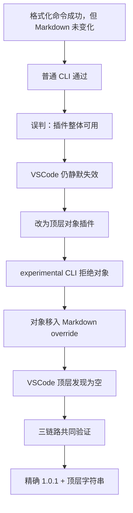
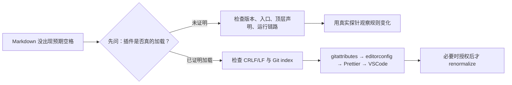
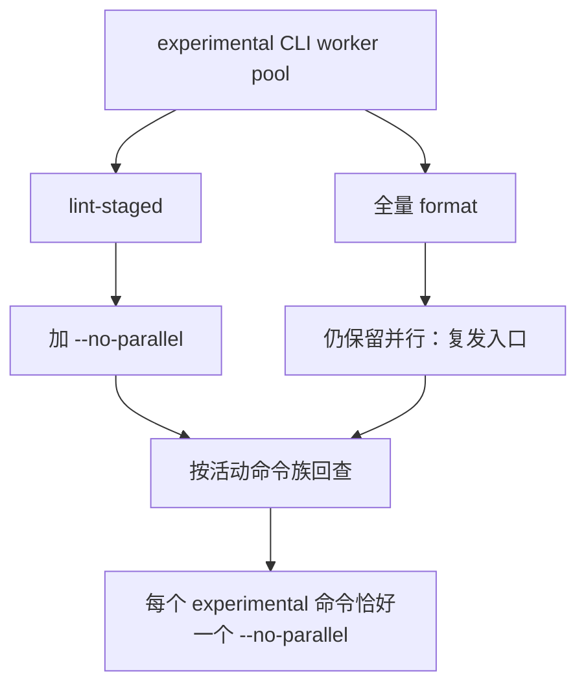
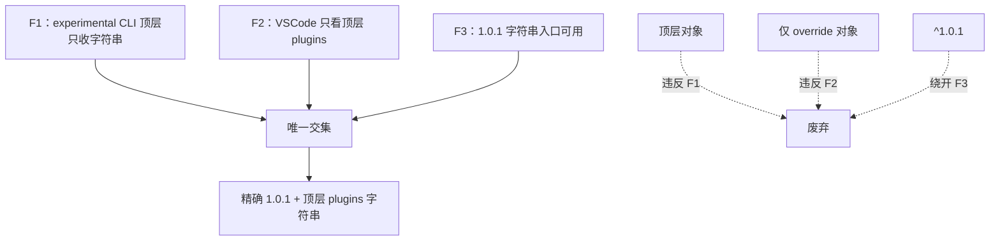
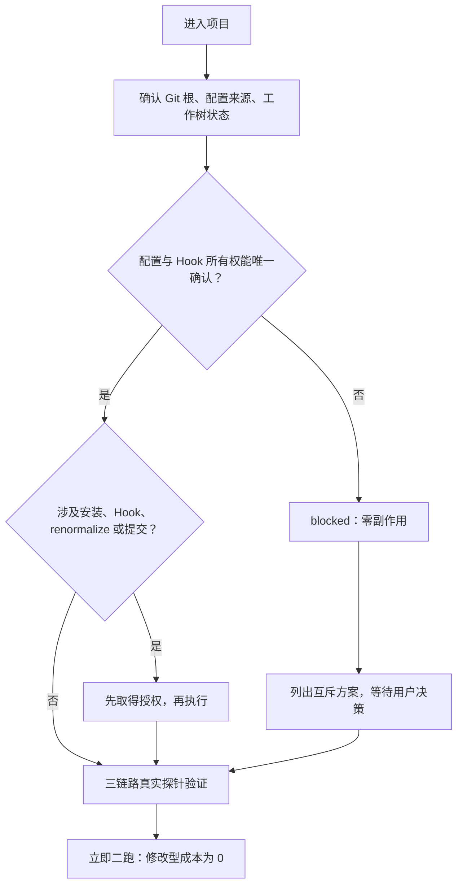

# 2026-08-20 prettier-plugin-lint-md：一次“格式化成功”的漫长误诊

> Agent 工具：Codex
>
> AI 模型：OpenAI GPT-5 系列 Codex
>
> 证据范围：2026-08-10 预探索交接包、`init-prettier-git-hooks` v3.2 引用文档，以及跨项目历史复盘。
>
> 本文记录的是历史经验。项目计数、阻断码和旧配置均为当时快照，不能替代今天的重新取证。

“Prettier 退出 0，但中文和英文之间的空格还是没有出来。”

这句话听上去像一个小问题：插件没加载，补个路径就行。实际却让多个仓库绕了半年。普通 CLI 能跑，VSCode 却静默失效；为了救 VSCode 换成对象插件，experimental CLI 又拒绝；给提交钩子关了并行，全量 `format` 却还保留着同一条崩溃入口。

最后收敛出的配置非常短：精确锁定 `prettier-plugin-lint-md@1.0.1`，在唯一生效的 Prettier 配置顶层使用字符串插件；所有 experimental CLI 活动命令带且只带一个 `--no-parallel`。真正昂贵的不是这几行字，而是确认它们能同时穿过普通 CLI、experimental CLI 和 VSCode 三条运行链路。



这篇文章不把它写成一份配置清单，而是复盘每一次“看起来已经修好了”的时刻，为什么还不够。

## 第一幕：先把“能找到包”当成了“插件能工作”

pnpm 严格隔离最容易看到的症状是：当前 cwd 找不到插件。于是 `.npmrc` 里出现了 `public-hoist-pattern`，把 `prettier`、`prettier-plugin-*` 和 `@prettier/*` 提升出来。这个动作并非错误；它能解决真正的“包不可见”。

问题在于，我们太早停止了调查：`require.resolve` 成功，只能说明找到了某个入口，不能说明找到的是正确版本，更不能说明 CJS/ESM 互操作后的插件对象仍是 Prettier 要的形状。lockfile 里出现 `1.0.1` 也不能证明当前 importer 和运行时正在使用它。

这里的转折，是把一个笼统的“插件问题”拆成两个问题：

- 包根本不可见时，才考虑 hoist；
- 包可见但行为异常时，继续检查版本、入口和插件声明，而不是重复 hoist。

这条分流后来被固定为一条排障纪律：hoist 是条件式修复，不是通用模板。

## 第二幕：我们把两棵故障树绑在了一起

Windows 下的 CRLF、Git index、编辑器自动换行和 Prettier 输出，足以制造“文件明明没改内容，却一直 modified”的幽灵修改。与此同时，lint-md 没生效也同样表现为 Markdown 看起来没有变化。两个现象长得太像，于是早期排障常常直接改 `.gitattributes`、跑 renormalize，或者怀疑 Hook。

但它们不是同一件事。



LF 的治理需要四层协作：`.gitattributes` 约束 Git，`.editorconfig` 约束编辑器，Prettier 的 `endOfLine: "lf"` 约束格式化输出，VSCode 设置补上编辑器端行为。但只改 `.gitattributes` 不会刷新既有 index；`git add --renormalize .` 会改暂存区，绝不是无害的“看看效果”。

所以现在的原则很简单：Markdown 没变化时，先证明 lint-md 是否加载；行尾问题和插件加载问题分别走自己的故障树。

## 第三幕：只修了一条命令，另一条入口还在

在 Windows、Node 22 和部分 Markdown/插件组合下，`--experimental-cli` 的 worker pool 曾抛出 `WorkTankWorkerError`。提交被阻塞后，最自然的修复是给 lint-staged 加 `--no-parallel`。提交恢复了，大家松了一口气。

但根脚本中的全量 `format` 仍在并行。换句话说：我们消掉了一个按钮后的风险，却让另一个更常用的按钮继续通向同一个崩溃点。



真正的规则不是“在某个文件加一个参数”，而是按命令族检查：`format`、lint-staged、Hook 或 PR 工作流中所有活动的 experimental CLI 命令都必须恰好有一个 `--no-parallel`。普通 CLI 不要因此背上实验参数。

## 第四幕：版本漂移把“字符串不可靠”变成了一次错觉

`^1.0.1` 看上去像是锁住了 1.0.1，实际上允许包管理器漂移到 1.0.3。问题恰恰发生在这种“依赖看起来没变”的时候。

| 运行条件                        | 1.0.1 顶层字符串 | 1.0.3 顶层字符串 |
| ------------------------------- | ---------------- | ---------------- |
| 普通 CLI                        | 生效             | 通常生效         |
| experimental CLI                | 生效             | 通常生效         |
| VSCode `esbenp.prettier-vscode` | 生效             | 可能静默失效     |

1.0.3 的 CJS `main` 和条件 exports 让 VSCode 的字符串解析可能拿到 `.cjs`。动态导入后，插件落进嵌套 `default`，Prettier 没取得应有的 `{ options, parsers }`。Format Document 仍会结束，只有 lint-md 规则没有注册。

这是一种危险的假绿：命令没错，编辑器也没报错，普通 CLI 甚至仍能跑。于是我们得出一个过早结论——“字符串插件不可靠”。

接着出现顶层对象插件。它确实绕过了 VSCode 的字符串入口，因此在局部测试里像是唯一安全答案。可它从来没有经过完整矩阵。

## 第五幕：对象方案和 override 方案，分别只救了一半

experimental CLI 的顶层插件 specifier 只接受字符串。顶层对象会得到：

```log
Non-string plugin specifiers are not supported yet
```

为了避开这条限制，对象插件被移进 `**/*.md` 的 override，顶层 `plugins` 留空。experimental CLI 不再报错，于是这又像一个答案。

可 VSCode 的扩展从 `resolveConfig(真实 Markdown 文件路径).plugins` 的顶层列表发现插件；顶层为空时，它根本不知道 Markdown override 里有那个对象。对象方案救了 VSCode、伤了 experimental CLI；override 方案救了 experimental CLI、伤了 VSCode。

三条约束放在一起，答案才显现：



这就是最终契约为什么同时要求精确版本和顶层字符串：不是偏好，而是三条运行时边界的唯一交集。

## 第六幕：把诊断参数写进了生产命令

后来有人发现显式传入 `--plugin prettier-plugin-lint-md` 能工作，于是把它写进 `format` 和 lint-staged 默认命令。这个决定当时很像防御性编程，实际却是另一种绕路：配置和命令都在声明插件，命令还额外依赖 cwd 下的裸包解析。

后续做了根 cwd、嵌套 cwd、绝对 Markdown 路径三组 A/B。无参数和显式参数的输出一致；lint-staged 从仓库根启动时会把 `process.cwd()` 传入任务。于是结论反过来：`--plugin` 只用于诊断和隔离实验，生产命令应让根配置成为唯一事实源。

## 第七幕：最成熟的行为，有时是停下

`init-prettier-git-hooks` 后来遇到的四类项目，提醒我们另一个教训：并不是每一个检测到的问题，都应该被脚本立刻“修好”。



- `01s-11comm` 与 `eams-component-lib` 的 lint-staged 是动态函数：它们负责文件过滤、路径引用、空列表分支和模板命令。不能 import/eval 来“看看结果”，也不能用正则整段替换。安全做法是保留行为、人工审阅并绑定 SHA-256；若要静态化，必须明确接受语义变化。
- `01s-11comm-app` 同时存在 Husky 和 simple-git-hooks 的所有权风险。先装一套“试试看”会让实际生效者取决于安装顺序。应由用户选择保留 Husky 的项目专用迁移，或明确授权迁移到 simple-git-hooks。
- `dfsw-assets-admin` 既有 Prettier 2，又有 `.mjs` 中的 CommonJS、空导出、旧 Husky/lint-staged 和大量 EOL 风险。Prettier 2 到 3 是破坏性升级，不能从嵌套目录顺手改父级 manifest 或 lockfile。

这四类项目的共同规则是：preflight 一旦 blocked，就保持零副作用。不装依赖、不写配置、不装 Hook、不执行 `git add --renormalize .`。历史文件中的文件数和风险计数只用于说明当时为何停止；真正执行前仍要重跑 `git status --short` 与 `git ls-files --eol`。

## 最后：不要再把“格式化成功”当成验收

最终验收不复杂，但必须完整。

1. 先核对版本三层：`package.json` 精确声明 `"1.0.1"`、lockfile 当前 importer、真实 cwd 下运行时包元数据，三者一致。
2. 准备同一份 Markdown 探针：包含中文与 ASCII、中文与数字，以及一个不会被普通 parser 自行改写的对照段。
3. 分别运行普通 CLI 与 `prettier --experimental-cli --no-parallel`，比较探针是否发生同一类 lint-md 变化。必要时才用显式 `--plugin` 做 A/B，不写回生产命令。
4. 在 VSCode 使用工作区 Prettier，对真实文件路径调用 `resolveConfig`，确认顶层 `plugins` 含字符串；Format Document 的输出必须与两条 CLI 一致。若只能做模拟，明确标记为“未完成完整 Extension Host UI 验收”。
5. 清理探针后检查 `git diff --check`、`git status --short`、`git diff` 和 `git diff --cached`。

`lint-staged --debug`、`pnpm exec simple-git-hooks`、真实提交、`git add --renormalize .` 都有副作用，需要单独授权。可选 `post-commit` 也默认不启用，它可能把 index 内容写回工作区，覆盖同文件的未暂存修改。

PR 工作流也不能绕过这些边界：不可信 fork 不应使用 `pull_request_target` 写回；只有同仓 PR 在明确权限下才能写回；只处理 `base...head` 的精确文件集合，禁止 `git add .` 和全仓格式化。

真正值得记住的并不是一段固定配置，而是一种验收习惯：把版本、声明形式、运行入口和解析根拆开；把 CRLF、Hook、Git index 和插件加载拆开；每当一条链路看起来成功，就问一句——另外两条呢？

## 时间证据链：半年绕路如何被逐步拆开

下面的日期来自这次故障相关的历史复盘记录。外发文章不公开内部记录编号和文件路径，只保留读者真正需要的时间、现象、证据和结论。

| 日期             | 当时观察到的事实                                                                                                              | 这条证据排除了什么                                                                                    |
| ---------------- | ----------------------------------------------------------------------------------------------------------------------------- | ----------------------------------------------------------------------------------------------------- |
| 2026-03-25       | Windows 项目确认四层 LF 防护必须同时存在：`.gitattributes`、`.editorconfig`、Prettier `endOfLine: "lf"`、VSCode `files.eol`。 | 排除了“只改 Git 配置就能解决幽灵修改”的想法，也说明 `endOfLine: "auto"` 会把问题带回 Windows。        |
| 2026-06-30       | `--experimental-cli` 的 worker pool 在 lint-staged 中可能抛出 `WorkTankWorkerError`；`--no-parallel` 能稳定提交钩子。         | 证明 worker 崩溃是运行模式问题，不是应该直接放弃 experimental CLI；同时暴露出 format 入口也必须回查。 |
| 2026-08-10       | 四类真实项目被 preflight 阻断：动态 lint-staged、动态模板命令、Husky/simple-git-hooks 所有权冲突、Prettier 2 与旧 CJS 配置。  | 证明“发现问题就自动改”会越过配置所有权、主版本升级和用户改动边界；blocked 必须零副作用。              |
| 2026-08-12 14:58 | 跨版本实验确认：experimental CLI 顶层对象会报 `Non-string plugin specifiers are not supported yet`；顶层字符串可以继续运行。  | 推翻“对象形式是所有入口的安全写法”，并把 experimental CLI 与 VSCode 的加载路径明确分开。              |
| 2026-08-12 15:14 | 三个事实合并：experimental CLI 顶层只收字符串，VSCode 只看顶层 `plugins`，1.0.1 的字符串入口可用。                            | 得到唯一全链路交集：精确 `1.0.1` + 顶层字符串；对象和仅 override 方案退出现行契约。                   |
| 2026-08-12 15:31 | 将版本、声明形式、运行链路和 pnpm 隔离放入同一矩阵，确认五类错误决策都源于只测单链路。                                        | 把“偶发玄学”还原为可枚举的四维组合，建立三链路回归规则。                                              |
| 2026-08-12 17:02 | 根 cwd、嵌套 cwd、绝对 Markdown 路径的 A/B 结果显示：无 `--plugin` 与显式 `--plugin` 输出一致。                               | 推翻“显式参数更健壮”，生产命令恢复为配置单一事实源。                                                  |
| 2026-08-12 17:44 | 最终写下命令边界：显式 `--plugin` 只用于诊断；experimental CLI 活动命令保留且只保留一个 `--no-parallel`。                     | 把一次性排障手段和长期生产契约分开，避免下一次复制错误补丁。                                          |

这条时间线真正提供的证据链是：

```text
行尾幽灵修改被拆分
  → worker 崩溃被定位到并行模式
  → 四类项目证明自动迁移必须先停下
  → 版本与入口差异解释 VSCode 静默失效
  → experimental CLI 拒绝对象插件
  → 三链路矩阵取交集
  → 生产命令与诊断命令分离
```

如果未来包入口、VSCode 扩展或 Prettier experimental CLI 再次变化，应该重新跑这条证据链，而不是从某一段旧配置复制一个“看起来更稳”的补丁。
