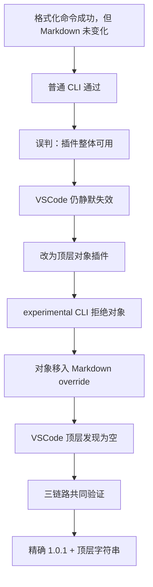
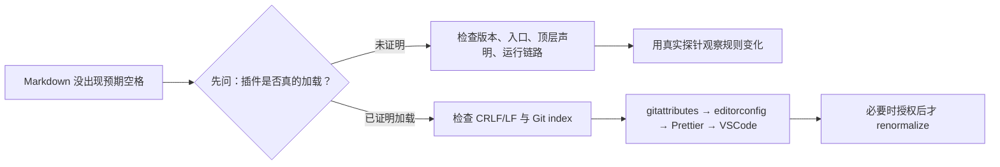
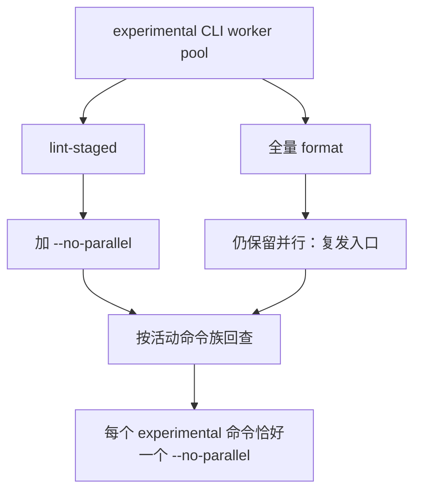
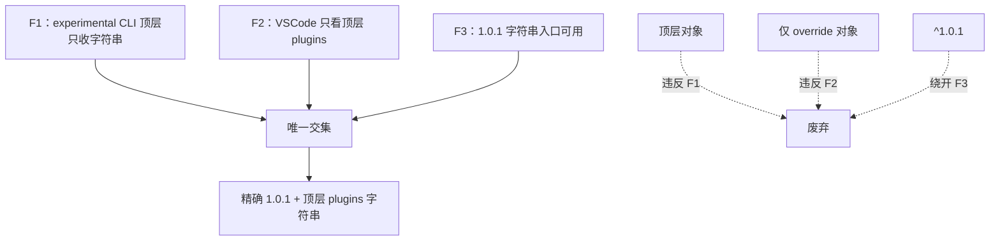
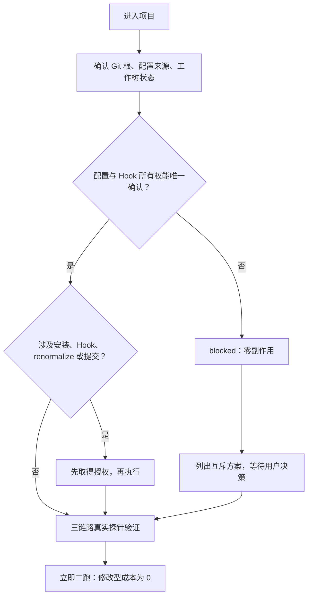

# Prettier 明明执行成功，Markdown 为什么还是没变？一次插件误诊复盘

> **摘要**：
>
> 我们曾经花了半年排查一个看似简单的问题：Prettier 退出码是 0，Markdown 却没有出现预期的中英文空格。真正的原因不是某一行配置写错，而是 pnpm 隔离、插件版本漂移、VSCode 与 experimental CLI 的加载方式，以及 Windows 并行执行问题叠在了一起。本文把这条排障路径重新走一遍，并给出可以复用的验收方法。

这件事的起点，是一句很容易被低估的话：

> “[Prettier](https://prettier.io/) 退出 0，但中文和英文之间的空格还是没有出来。”

听起来像插件没加载，补一个路径就结束了。可在多个仓库里，普通 CLI 能跑、VSCode 却静默失效；为了救 VSCode 换成对象插件后，experimental CLI 又开始拒绝；提交钩子加了参数，全量 `format` 仍然保留着同一个崩溃入口。

最后留下的配置其实很短：精确锁定 `prettier-plugin-lint-md@1.0.1`，在唯一生效的 [Prettier](https://prettier.io/) 配置顶层使用字符串插件；所有 experimental CLI 活动命令带且只带一个 `--no-parallel`。真正耗时的不是写出这几行，而是证明它们能同时通过普通 CLI、experimental CLI 和 [VSCode](https://code.visualstudio.com/) 三条运行链路。



下面不列一份“万能配置”，而是回顾每个看似合理的判断为什么不够，以及后来怎样把它验证清楚。

## 1. 找得到包，不等于插件真的能工作

[pnpm](https://pnpm.io/) 的严格隔离最先暴露出的症状通常是：当前 cwd 找不到插件。于是 `.npmrc` 里出现了 `public-hoist-pattern`，把 `prettier`、`prettier-plugin-*` 和 `@prettier/*` 提升出来。

这个动作本身没有错，它确实能解决“包不可见”。问题是我们常常在 `require.resolve` 成功后就停止调查。它只能说明某个入口被找到，不能说明它是正确版本，也不能说明 CJS/ESM 互操作后得到的对象仍符合 Prettier 的插件形状。lockfile 里出现 `1.0.1`，同样不能证明当前 importer 和运行时正在使用它。

后来我把“插件问题”拆成两个分支：包根本不可见时，才考虑 hoist；包可见但行为异常时，继续检查版本、入口和插件声明，不再重复 hoist。**hoist 是条件式修复，不是插件失效时的通用模板。**

## 2. 行尾幽灵修改，和插件没加载不是一棵故障树

Windows 下的 CRLF、Git index、编辑器自动换行和 Prettier 输出，足以制造“文件内容没变，却一直 modified”的幽灵修改。lint-md 没生效也会让 Markdown 看起来没有变化。两个现象太像，早期排障经常一上来就改 `.gitattributes`、跑 renormalize，或者怀疑 Hook。



LF 治理需要四层配合：`.gitattributes` 约束 Git，`.editorconfig` 约束编辑器，Prettier 的 `endOfLine: "lf"` 约束格式化输出，VSCode 设置补上编辑器端行为。只改 `.gitattributes` 不会刷新已有 index；`git add --renormalize .` 会修改暂存区，绝不是无害的“看看效果”。所以 Markdown 没变化时，先证明 lint-md 是否加载；只有插件确认加载，才进入 CRLF/LF 和 Git index 的排查。

## 3. 给一个入口加参数，不代表另一个入口也安全

在 Windows、Node 22 和部分 Markdown/插件组合下，`--experimental-cli` 的 worker pool 曾抛出 `WorkTankWorkerError`。提交被阻塞后，给 [lint-staged](https://github.com/lint-staged/lint-staged) 加 `--no-parallel` 很自然。提交恢复了，问题看起来像解决了。

但根脚本中的全量 `format` 仍在并行。我们只是修好了一个按钮，另一个更常用的按钮还通向同一个崩溃点。



真正的规则不是“在某个文件里加一个参数”，而是按命令族检查：`format`、lint-staged、Hook 或 PR 工作流中所有活动的 experimental CLI 命令，都必须恰好有一个 `--no-parallel`。普通 CLI 不要因此背上实验参数。

## 4. 版本漂移制造了“字符串不可靠”的错觉

`^1.0.1` 看起来像锁住了 1.0.1，实际上允许包管理器漂移到 1.0.3。问题恰恰发生在“依赖看起来没变”的时候。

|            运行条件             | 1.0.1 顶层字符串 | 1.0.3 顶层字符串 |
| :-----------------------------: | :--------------: | :--------------: |
|            普通 CLI             |       生效       |     通常生效     |
|        experimental CLI         |       生效       |     通常生效     |
| VSCode `esbenp.prettier-vscode` |       生效       |   可能静默失效   |

1.0.3 的 CJS `main` 和条件 exports 让 VSCode 的字符串解析可能拿到 `.cjs`。动态导入后，插件落进嵌套 `default`，Prettier 没拿到应有的 `{ options, parsers }`。Format Document 仍会结束，只有 lint-md 规则没有注册。

这就是危险的“假绿”：命令没报错，编辑器也没报错，普通 CLI 甚至还能工作。我们一度因此得出“字符串插件不可靠”的结论，于是出现了顶层对象插件。它绕过了 VSCode 的字符串入口，在局部测试里很安全，但还没有经过完整矩阵验证。

## 5. 对象插件和 override，各自只救了一半

experimental CLI 的顶层插件 specifier 只接受字符串。顶层对象会得到：

```log
Non-string plugin specifiers are not supported yet
```

为绕开这条限制，我们把对象插件移进 `**/*.md` 的 override，顶层 `plugins` 留空。experimental CLI 不再报错，于是这个方案又像是答案。

可 VSCode 扩展会根据 `resolveConfig(真实 Markdown 文件路径).plugins` 的顶层列表发现插件；顶层为空时，它根本不知道 Markdown override 里还有一个对象。对象方案救了 VSCode、伤了 experimental CLI；override 方案救了 experimental CLI、伤了 VSCode。



最终契约同时要求精确版本和顶层字符串，不是因为这种写法更优雅，而是因为它是三条运行时边界的唯一交集。

## 6. 诊断参数不要变成生产配置

后来有人发现，显式传入 `--plugin prettier-plugin-lint-md` 能工作，于是把它写进 `format` 和 lint-staged 默认命令。这看起来像防御性编程，实际却让配置和命令同时声明插件，还额外依赖 cwd 下的裸包解析。

我们做了三组 A/B：根 cwd、嵌套 cwd、绝对 Markdown 路径。无参数和显式参数的输出一致；lint-staged 从仓库根启动时也会把 `process.cwd()` 传入任务。

结论因此反过来：`--plugin` 只用于诊断和隔离实验，生产命令应让根配置成为唯一事实源。排障时可以临时加参数，合并配置时就应该把它拿掉。

## 7. 有些项目最成熟的处理，是先停下来

`init-prettier-git-hooks` 后来遇到的四类项目，又提醒了我：检测到问题，不等于脚本有权立刻“修好”。



- `01s-11comm` 与 `eams-component-lib` 的 lint-staged 是动态函数，负责文件过滤、路径引用、空列表分支和模板命令。不能 import/eval 来“看看结果”，也不能用正则整段替换。安全做法是保留行为、人工审阅并绑定 SHA-256；如果要静态化，必须明确接受语义变化。
- `01s-11comm-app` 同时存在 Husky 和 simple-git-hooks 的所有权风险。应由用户选择保留 Husky 的项目专用迁移，或明确授权迁移到 simple-git-hooks。
- `dfsw-assets-admin` 同时存在 Prettier 2、`.mjs` 中的 CommonJS、空导出、旧 Husky/lint-staged 和大量 EOL 风险。Prettier 2 到 3 是破坏性升级，不能从嵌套目录顺手改父级 manifest 或 lockfile。

共同规则是：preflight 一旦 blocked，就保持零副作用。不装依赖、不写配置、不装 Hook、不执行 `git add --renormalize .`。真正执行前，仍要重新跑 `git status --short` 与 `git ls-files --eol`。

## 8. 最终验收：不要再把“格式化成功”当成结论

1. 核对版本三层：`package.json` 精确声明 `"1.0.1"`、lockfile 当前 importer、真实 cwd 下的运行时包元数据，三者一致。
2. 准备同一份 Markdown 探针，包含中文与 ASCII、中文与数字，以及一段不会被普通 parser 自行改写的对照文本。
3. 分别运行普通 CLI 与 `prettier --experimental-cli --no-parallel`，比较探针是否发生同一类 lint-md 变化。只有需要隔离问题时，才用显式 `--plugin` 做 A/B。
4. 在 VSCode 使用工作区 Prettier，对真实文件路径调用 `resolveConfig`，确认顶层 `plugins` 含字符串；Format Document 的输出必须与两条 CLI 一致。只能模拟时，要标记为“未完成完整 Extension Host UI 验收”。
5. 清理探针后检查 `git diff --check`、`git status --short`、`git diff` 和 `git diff --cached`。

`lint-staged --debug`、`pnpm exec simple-git-hooks`、真实提交、`git add --renormalize .` 都有副作用，需要单独授权。可选 `post-commit` 默认不启用，它可能把 index 内容写回工作区，覆盖同文件的未暂存修改。

PR 工作流也不能绕过这些边界：不可信 fork 不应使用 `pull_request_target` 写回；只有同仓 PR 在明确权限下才能写回；只处理 `base...head` 的精确文件集合，禁止 `git add .` 和全仓格式化。

## 9. 半年排障时间线：我们是怎样把问题拆开的

下面的日期来自这次故障相关的历史复盘记录。文章不公开内部记录编号和文件路径，只保留读者真正需要的时间、现象、证据和结论。

|       日期       |                                                       当时观察到的事实                                                        |                   这条证据排除了什么                   |
| :--------------: | :---------------------------------------------------------------------------------------------------------------------------: | :----------------------------------------------------: |
|    2026-03-25    | Windows 项目确认四层 LF 防护必须同时存在：`.gitattributes`、`.editorconfig`、Prettier `endOfLine: "lf"`、VSCode `files.eol`。 |     排除了“只改 Git 配置就能解决幽灵修改”的想法。      |
|    2026-06-30    |     `--experimental-cli` 的 worker pool 在 lint-staged 中可能抛出 `WorkTankWorkerError`；`--no-parallel` 能稳定提交钩子。     | 证明崩溃是运行模式问题，也暴露出 format 入口必须回查。 |
|    2026-08-10    |          四类真实项目被 preflight 阻断：动态 lint-staged、动态模板命令、Hook 所有权冲突、Prettier 2 与旧 CJS 配置。           | 证明“发现问题就自动改”会越过配置所有权和用户改动边界。 |
| 2026-08-12 14:58 |          experimental CLI 顶层对象报 `Non-string plugin specifiers are not supported yet`；顶层字符串可以继续运行。           |          推翻“对象形式是所有入口的安全写法”。          |
| 2026-08-12 15:14 |                     experimental CLI 顶层只收字符串，VSCode 只看顶层 `plugins`，1.0.1 的字符串入口可用。                      |    得到唯一全链路交集：精确 `1.0.1` + 顶层字符串。     |
| 2026-08-12 15:31 |                                     将版本、声明形式、运行链路和 pnpm 隔离放入同一矩阵。                                      |           证明五类错误决策都源于只测单链路。           |
| 2026-08-12 17:02 |                根 cwd、嵌套 cwd、绝对 Markdown 路径的 A/B 结果显示：无 `--plugin` 与显式 `--plugin` 输出一致。                |                 推翻“显式参数更健壮”。                 |
| 2026-08-12 17:44 |                明确命令边界：显式 `--plugin` 只用于诊断；experimental CLI 活动命令只保留一个 `--no-parallel`。                |               把排障手段和生产契约分开。               |

这条时间线真正提供的不是一段固定配置，而是一套拆问题的方法：

```text
行尾幽灵修改被拆分
  → worker 崩溃被定位到并行模式
  → 四类项目证明自动迁移必须先停下
  → 版本与入口差异解释 VSCode 静默失效
  → experimental CLI 拒绝对象插件
  → 三链路矩阵取交集
  → 生产命令与诊断命令分离
```

## 10. 写在最后：每条链路都要回答“另外两条呢？”

这次排障最值得留下的，不是一段需要背下来的配置，而是一个验收习惯：把版本、声明形式、运行入口和解析根拆开；把 CRLF、Hook、Git index 和插件加载拆开。

当一条链路看起来已经成功时，不要急着关单，先问一句：**另外两条呢？**

如果未来包入口、VSCode 扩展或 Prettier experimental CLI 再次变化，就重新跑一遍这条证据链，而不是从旧配置里复制一个“看起来更稳”的补丁。
