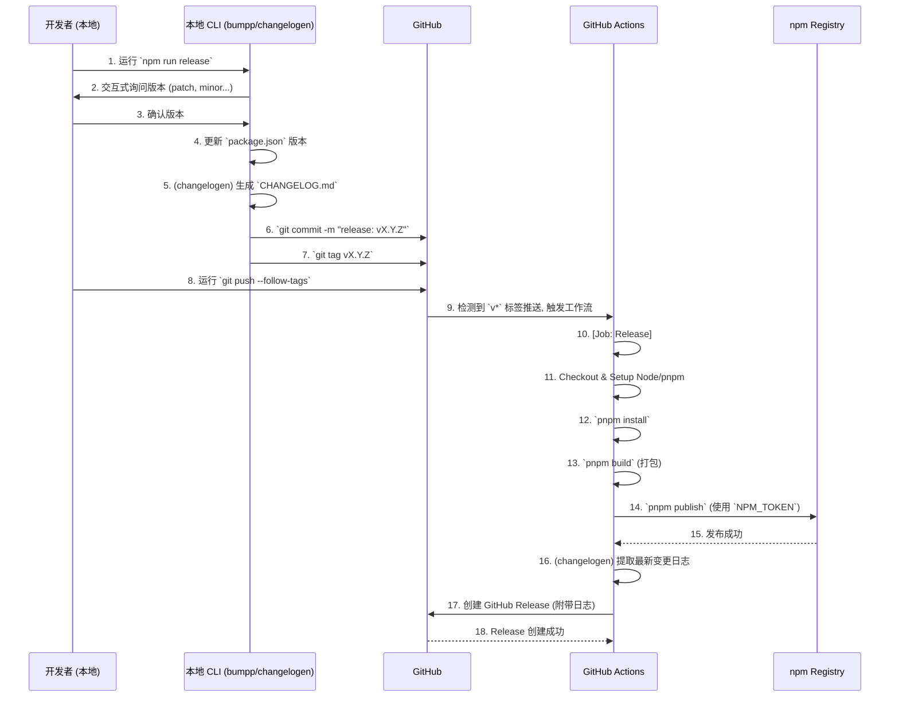

# gemini 的调研报告

关于 antfu (Anthony Fu) 依赖包发布方案的调研报告

## 一、核心流程总结

antfu (Anthony Fu) 的依赖包发布流程是一种高效的**半自动化（Semi-automated）方案。该方案并非由 CI/CD 自动触发（例如合并到 `main` 分支就自动发版），而是依赖开发者在本地手动发起一个发布动作**。

这个动作会触发一系列本地脚本，自动完成版本号提升、变更日志（Changelog）生成、Git 提交和打标签（Tag）。随后，开发者手动将这些变更推送到 GitHub。GitHub Actions 会监听到这个**新的标签推送**，然后才开始接管后续的自动化工作：构建、测试，并最终发布到 npm Registry，同时创建 GitHub Release。

他的这套流程主要依赖他自己开发的两个核心工具：

1.  **`bumpp`**: 一个交互式的版本号提升工具。
2.  **`changelogen`**: 一个基于 Conventional Commits（约定式提交）的变更日志生成工具。

---

## 二、关键问题详解

以下是针对您提出的几个关键问题的详细调研结果。

### 1\. 依赖包的发布方案

他采用的是“**本地 CLI 触发 + 远程 GitHub Actions 发布**”的组合方案。

1.  **本地触发**: 开发者在本地终端运行一个 npm 脚本，通常是 `npm run release`。
2.  **脚本执行**: 这个脚本会依次执行 `bumpp` 和 `changelogen`。
    - `bumpp` 会交互式地询问开发者要升级哪个版本（patch, minor, major），然后自动修改 `package.json` 中的版本号，并自动执行 `git commit` 和 `git tag`。
    - `changelogen` 会自动扫描从上一个 tag 到现在的 Git 提交记录，根据 Conventional Commits 规范（如 `feat:`, `fix:`, `perf:` 等）生成 Markdown 格式的变更日志，并更新到 `CHANGELOG.md` 文件中。`bumpp` 在提交时会把这个变更也包含进去。
3.  **手动推送**: 开发者在本地确认无误后，执行 `git push --follow-tags` 将新的提交和新的 tag 一起推送到 GitHub。
4.  **远程发布**: GitHub Actions 监听到有新的 tag（例如 `v1.2.3`）被推送，自动触发发布工作流（Workflow），该工作流负责将包发布到 npm。

### 2\. 依赖包版本升级

他主要使用自研的 **`bumpp`** 工具来实现版本升级。

- **工作模式**: 当在项目根目录运行 `bumpp` 时，它会：
  1.  读取当前的 `package.json` 版本号。
  2.  提供一个交互式界面，让开发者选择要升级的级别：`patch`（补丁）、`minor`（次版本）、`major`（主版本）或指定一个确切的版本号。
  3.  自动修改所有相关文件中的版本号（主要是 `package.json`，如果是 monorepo 还会处理工作区内的依赖关系）。
  4.  自动执行 `git commit`，提交一个类似 `release: v1.2.3` 的提交。
  5.  自动在这个 commit 上打一个 `v1.2.3` 的 Git 标签。

### 3\. GitHub Release 更新日志生成

此功能通过 **`changelogen`** 和 **GitHub Actions** 配合实现。

1.  **本地生成日志**: `changelogen` 工具会扫描 Git 历史，生成遵循 _Keep a Changelog_ 规范的 Markdown 文本。这个文本在 `bumpp` 运行时被更新到项目根目录的 `CHANGELOG.md` 文件中。
2.  **CI 提取日志**: 在 GitHub Actions 的发布工作流中，有一个专门的步骤。这个步骤会：
    - 使用 `changelogen` 提供的 CLI 命令（如 `changelogen --output`）或自定义脚本，从 `CHANGELOG.md` 文件中**提取出最新版本的变更描述**。
    - 将这段 Markdown 文本作为输出（output）变量。
    - 在后续创建 GitHub Release 的步骤中（通常使用如 `actions/create-release` 或 `gh release create` 命令），将这个变量作为 Release 的 `body`（正文）内容传入。

### 4\. GitHub Workflow 配置与触发

他的工作流配置文件（如 `.github/workflows/release.yml`）是发版的关键。

- **触发条件 (Trigger)**: 工作流的核心触发器是**基于 Git 标签的推送**。

  ```yaml
  on:
    push:
      tags:
        - "v*" # 匹配所有以 'v' 开头的 tag，例如 v1.0.0, v2.3.4-beta.0
  ```

  这意味着，只有当开发者在本地完成版本升级并**推送了新的 `v*` 标签**时，发布流程才会被激活。

- **工作流配置 (Jobs)**:
  - `checkout`: 检出代码。
  - `setup`: 设置 Node.js, pnpm 等环境。
  - `install`: 安装依赖 (`pnpm install`)。
  - `build`: 执行打包 (`pnpm build`)。
  - `publish`: 执行发布（见下一节）。
  - `create-release`: 创建 GitHub Release（见上一节）。

### 5\. Node.js 包的打包与推送

这是在 GitHub Actions 工作流的 `jobs` 中配置的。

- **打包 (Build)**:
  - 他通常使用 `unbuild`（他自己的另一个工具）或 `tsup` 来打包。
  - 在 `package.json` 中会有一个 `build` 脚本，例如 `"build": "unbuild"`。
  - 工作流中会运行 `pnpm build` 来执行这个打包命令。

- **推送到 npm (Publish)**:
  - 工作流中使用 `pnpm publish`（或 `npm publish`）。
  - 为了通过 npm 的认证，工作流中会有一个步骤，使用 `actions/setup-node` 来配置 npm 的认证 Token。
  - 这个 Token 从仓库的 **GitHub Secrets** 中读取（例如 `secrets.NPM_TOKEN`）。

  <!-- end list -->

  ```yaml
  - name: Publish to npm
    uses: actions/setup-node@v4
    with:
      node-version: 18
      registry-url: "https://registry.npmjs.org" # 设置 npm registry

  - run: pnpm publish --access public --no-git-checks
    env:
      NODE_AUTH_TOKEN: ${{ secrets.NPM_TOKEN }} # 注入 npm token
  ```

  - `--no-git-checks` 参数是为了告诉 `pnpm` 不要在 CI 环境中检查 Git 仓库是否干净，因为版本已经在本地提交过了。

### 6\. Monorepo 仓库版本管理策略

**各自独立发布 (Independent Versioning)。**

antfu 是 `pnpm` 的重度用户和贡献者。他管理 monorepo（如 `unocss`, `vite-ecosystem`, `eslint-flat-config` 等）时，采用的是 pnpm workspaces 的原生管理方式。

- 他**不使用** Lerna 或 Changesets 的“统一版本号”（Fixed/Locked mode）策略。
- `packages/` 目录下的每个包（package）都有**各自独立**的 `package.json` 和版本号。
- 当他想发布某个包时，他会 `cd` 到那个包的目录（例如 `cd packages/core`），然后在**该目录内**运行 `npm run release`（即 `bumpp`）。`bumpp` 会非常智能地只更新当前包的版本，并处理工作区内其他包对它的依赖版本。
- 这种独立版本策略提供了极高的灵活性，允许 `core` 包发布 `v1.5.0`，而 `plugin-a` 包可能还停留在 `v0.2.0`，只有在需要时才进行升级。

---

## 三、发包流程可视化 (Mermaid)

以下是 antfu 发包流程的可视化图表，展示了从开发者本地到 npm 发布的完整闭环：


