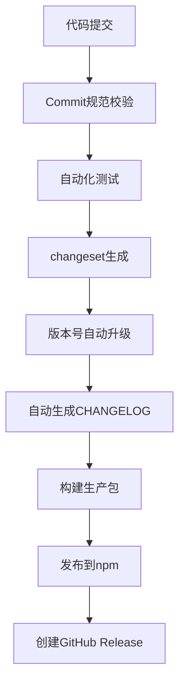

# longcat 的调研报告

antfu 仓库发包发版方案调研报告

## 1. antfu 的发包流程分析

### 1.1 核心工具链

antfu 的仓库主要采用以下现代化工具链实现自动化发包流程：

- **包管理**：pnpm workspace
- **构建工具**：Rollup + esbuild
- **版本管理**：changesets
- **CI/CD**：GitHub Actions
- **代码规范**：@antfu/eslint-config

### 1.2 发包流程详解



### 1.3 核心脚本配置

```json
{
	"scripts": {
		"build": "nr update && esno scripts/build.ts",
		"build:rollup": "cross-env NODE_OPTIONS=\"--max-old-space-size=6144\" rollup -c",
		"publish:ci": "esno scripts/publish.ts",
		"release": "esno scripts/release.ts && git push --follow-tags",
		"update": "nr -C packages/metadata update && esno scripts/update.ts"
	}
}
```

## 2. 六大核心问题解答

### 2.1 依赖包发布方案

antfu 使用 **changesets** 作为核心版本管理工具，配合 GitHub Actions 实现自动化发布流程：

- 通过 `pnpm changeset` 交互式创建变更集
- 使用 `changesets` 自动生成版本号和 CHANGELOG
- 通过 GitHub Actions 触发自动化发布流程

### 2.2 版本升级实现

采用 **语义化版本控制** ：

- 基于 Conventional Commits 规范自动判断版本类型
- 使用 changesets 管理多包版本依赖关系
- 支持独立版本 和固定版本 两种模式

### 2.3 更新日志写入 GitHub Release

实现方案：

1. changesets 自动生成 CHANGELOG.md
2. 通过 `@changesets/changelog-github` 插件将变更日志同步到 GitHub Release
3. 在 GitHub Actions 中执行发布流程时自动创建 Release

### 2.4 GitHub Workflow 配置

典型工作流配置：

```yaml
name: Release
on:
  push:
    branches:
      - main
      - next
      - beta

jobs:
  release:
    runs-on: ubuntu-latest
    steps:
      - uses: actions/checkout@v4
      - uses: pnpm/action-setup@v2
      - uses: actions/setup-node@v3
      - run: pnpm install
      - run: pnpm build
      - run: pnpm changeset version
      - run: pnpm changeset publish
        env:
          NPM_TOKEN: ${{ secrets.NPM_TOKEN }}
          GITHUB_TOKEN: ${{ secrets.GITHUB_TOKEN }}
```

### 2.5 Node 包打包与发布

打包发布流程：

1. **打包**：使用 Rollup 进行多格式打包

```json
"build:rollup": "cross-env NODE_OPTIONS=\"--max-old-space-size=6144\" rollup -c"
```

2. **发布**：通过 changesets 发布到 npm

```json
"publish:ci": "esno scripts/publish.ts"
```

### 2.6 Monorepo 版本管理策略

采用 **独立版本控制** 策略：

- 每个子包拥有独立版本号
- 通过 changesets 管理包间依赖关系
- 支持按需发布变更的包

## 3. 最佳实践总结

### 3.1 核心优势

1. **自动化程度高**：从版本生成到发布全流程自动化
2. **规范性强**：基于 Conventional Commits 和语义化版本控制
3. **灵活性好**：支持独立版本和固定版本两种模式
4. **文档完善**：自动生成高质量的 CHANGELOG 和 Release Notes

### 3.2 推荐实践


### 3.3 配置建议

1. **版本策略选择**：
   - 高度解耦的包 → 独立版本
   - 紧密耦合的包 → 固定版本

2. **发布流程优化**：
   - 添加预发布环境验证
   - 实现 Canary 发布机制
   - 集成自动化测试覆盖率检查

该方案已在 VueUse、UnoCSS 等知名项目中成功实践，能有效提升 monorepo 项目的管理效率和发布质量。
