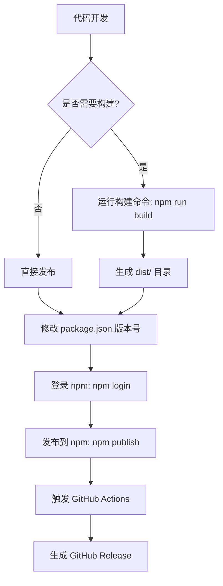

# minimaxi 的调研报告

antfu 仓库发包发版方案调研报告

---

#### 一、antfu 发包流程详解

**1. 依赖包发布方案**  
antfu 的项目主要采用以下流程发布 npm 包：

- **初始化配置**：通过 `npm init -y` 生成 `package.json`，配置 `name`（包名）、`version`（版本）、`main`（入口文件）、`files`（包含文件）等字段。
- **打包构建**：使用 `tsup` 或 `webpack` 进行代码编译和打包，生成 `dist` 目录下的构建产物。例如通过 `tsup` 的 `tsup.config.ts` 配置输出格式为 `cjs` 和 `esm`。
- **发布到 npm**：执行 `npm publish` 命令，需提前通过 `npm login` 登录 npm 账号。
- **忽略文件**：通过 `.npmignore` 文件排除无关文件（如 `node_modules`、`test` 等）。

**2. 依赖包版本升级**

- **手动更新**：在 `package.json` 中修改 `version` 字段（遵循 SemVer 规范），例如从 `1.0.0` 升级到 `1.0.1`。
- **自动化工具**：可能结合 `lerna` 或 `pnpm` 的 `workspace` 功能统一管理多包版本（monorepo 场景）。

**3. 更新日志写入 GitHub Release**

- **GitHub Actions 自动化**：通过工作流（`.github/workflows` 目录下的 YAML 文件）在发布时自动生成 Release Notes，例如在 `publish` 事件触发时调用 `actions/create-release` 等工具。
- **手动提交**：在 GitHub 的 Release 页面手动填写更新日志（可能结合 `CHANGELOG.md` 文件）。

**4. GitHub 工作流配置**

- **触发条件**：通常在 `push` 到 `main` 分支或打 `tag` 时触发工作流，例如：
  ```yaml
  on:
    push:
      branches: [main]
    release:
      types: [published]
  ```
- **执行步骤**：
  1. 安装依赖（`npm install`）
  2. 运行测试（`npm test`）
  3. 构建打包（`npm run build`）
  4. 发布到 npm（`npm publish`）。

**5. Node 包打包配置**

- **入口文件**：`package.json` 的 `main` 字段指向构建后的入口（如 `dist/index.js`）。
- **打包工具**：
  - **tsup**：配置 `tsup.config.ts` 定义输出格式、类型声明等。
  - **webpack**：通过 `webpack.config.js` 设置 `output.library` 和 `libraryTarget` 为 `umd` 兼容多种模块系统。

**6. Monorepo 版本管理**

- **独立版本**：各子包在 `package.json` 中维护独立版本号，通过 `pnpm` 或 `lerna` 批量发布。
- **统一版本**：可能通过 `catalog` 功能在 `pnpm-workspace.yaml` 中集中管理依赖版本，但包本身仍独立发版。

---

#### 二、antfu 发包流程 Mermaid 图



---

#### 三、关键流程说明

**1. 初始化与配置**

- 通过 `npm init` 生成基础配置，结合 `tsconfig.json` 和 `tsup.config.ts` 定义 TypeScript 编译规则。
- Monorepo 场景下使用 `pnpm-workspace.yaml` 管理多包依赖版本。

**2. 自动化发布**

- GitHub Actions 工作流示例：
  ```yaml
  name: Release
  on:
    push:
      tags:
        - "v*"
  jobs:
    publish:
      runs-on: ubuntu-latest
      steps:
        - uses: actions/checkout@v4
        - uses: actions/setup-node@v3
          with:
            node-version: 20
            registry-url: https://registry.npmjs.org
        - run: npm ci
        - run: npm run build
        - run: npm publish
          env:
            NODE_AUTH_TOKEN: ${{ secrets.NPM_TOKEN }}
  ```
  通过 `npm publish` 和 npm token 实现安全发布。

**3. 版本管理策略**

- **独立发版**：各子包在 `package.json` 中设置独立 `version`，通过 `npm publish` 分别发布。
- **统一发版**：可能通过 `lerna version` 或 `pnpm version` 批量更新版本并发布（需结合 monorepo 工具）。

---

**注**：以上结论基于提供的搜索结果片段推断，具体实现可能因项目结构差异略有不同。建议直接参考 antfu 的 GitHub 仓库（如 `antfu/releases.antfu.me`）和 npm 包源码验证细节。
