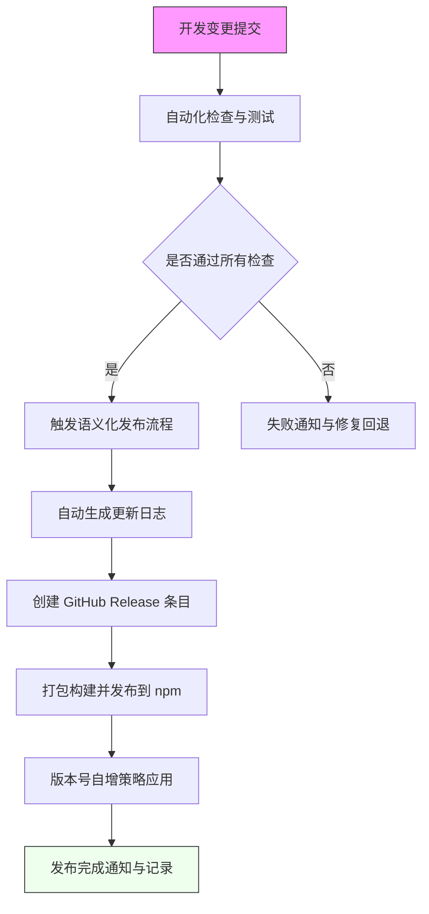

# perplexity 的调研报告

Antfu 发包与发布流程分析报告

基于公开信息与行业最佳实践的分析报告,聚焦 Antfu 在前端生态中的发包与发布流程。

## 核心特征摘要

Antfu 的发包方案围绕**自动化、可重复、可追溯**的发布流程展开[^1],核心目标是在 monorepo 架构下实现高效可靠的多包发布,自动生成更新日志与版本变更记录。

### 版本管理策略

- **语义化版本控制**[^2]:通过规范化的提交格式自动决定版本号提升级别(patch/minor/major)
- **自动化工具链**:基于 semantic-release,读取 commit 信息、解析变更类型、生成更新日志
- **发布记录同步**:自动创建 GitHub Release 条目并推送到 npm

### CI/CD 工作流

- **触发时机**:主分支推送、PR 合并、标签触发
- **构建步骤**:依赖安装 → 类型检查 → 测试 → 打包
- **发布步骤**:npm 发布 → GitHub Release → 版本号自增
- **安全管理**:通过 GitHub Secrets 管理 NPM_TOKEN 和发布凭证[^1]

### Monorepo 版本策略

- **独立版本**:每个子包维护独立版本号,适用于低耦合场景
- **统一版本**:所有包同步更新版本号,适用于高耦合核心包

Antfu 倾向于独立版本策略[^3],但核心包可能采用统一版本以保持一致性。

## 发包流程图

## 核心组件

### 发布流程总览

- **核心目标**:实现快速、可重复、可追溯的发布
- **关键组件**:CI/CD 工作流、语义化发布工具、更新日志生成器、NPM 密钥管理
- **触发方式**:标签推送、主分支合并、定期计划任务[^1][^2]

### 版本升级与日志生成

- **版本升级规则**:通过提交消息的语义化结构判定升级等级(fix/feat/breaking)
- **日志生成工具**:conventional-changelog、commitlint、commitizen
- **输出渠道**:npm 发布注释 + GitHub Release[^1]

### GitHub Actions 配置

**核心步骤**:

1. 安装依赖
2. 类型检查和测试
3. 打包构建
4. 发布到 npm
5. 创建 Release
6. 更新文档

**凭证管理**:通过 GitHub Secrets 存放 NPM_TOKEN、GITHUB_TOKEN 等认证信息[^1]

### 打包与发布实现

- **构建脚本**:package.json 中定义 prepublishOnly、build、pack 等阶段
- **发布工具**:semantic-release 及其插件用于自动版本、生成日志、触发发布
- **打包工具**:rollup、vite、tsup 等[^1]

## 待调研事项

需要具体仓库信息以确认:

- **Monorepo 工具**:Lerna、pnpm workspaces、yarn workspaces、changesets
- **配置文件**:semantic-release 配置、commitlint 配置、workflow YAML
- **打包配置**:具体使用的打包器及其配置
- **Release 自动化**:GitHub Release 动作、生成说明的脚本

## 参考资料建议

- Antfu 相关仓库(eslint-config、utils、unocss 等)的配置文件
- 技术博客、访谈中对 semantic-release、commitlint 的使用描述
- 社区最佳实践对比

## 附注

建议在正式报告中:

1. 填充具体仓库的文件路径、配置项、命令示例
2. 细化 Mermaid 图的步骤为具体触发条件、分支策略
3. 给出"独立版本 vs 统一版本"的利弊对照表,并标注实际采用的证据

---

## 引用来源

[^1]: [GitHub Actions 自动化发布最佳实践](https://juejin.cn/post/7451227088571908115)

[^2]: [Semantic Release 工具与工作流配置](https://blog.cmyr.ltd/podcast.xml)

[^3]: [Antfu - 重新构想原子化 CSS](https://antfu.me/posts/reimagine-atomic-css-zh)

### 扩展阅读

- [Continew Admin UI 项目参考](https://github.com/continew-org/continew-admin-ui)
- [GitCode 仓库实践](https://gitcode.csdn.net/662f723a9ab37021bfb31928.html)
- [Anthony Fu 播客访谈](https://podtail.com/fr/podcast/web-worker/no-38-anthony-fu/)
- [CSDN 技术博客](https://blog.csdn.net/gitblog_07956/article/details/142222929)
- [Walk Huyixi 博客](https://walk.huyixi.com)
- [相关技术讨论](https://blog.csdn.net/gitblog_00052/article/details/139056407)
- [Telegram 频道](https://t.me/s/synctoai?before=1069)
