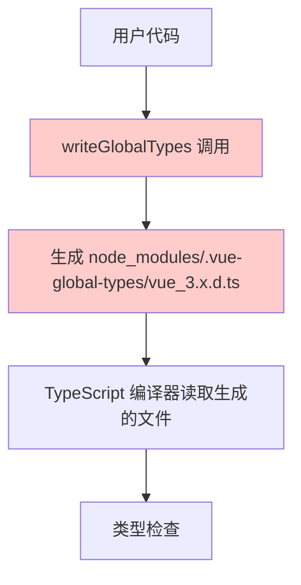
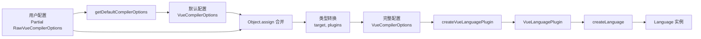

# @vue/language-core v3.2.0 升级适配报告

> **文档版本：** 1.0
> **生成时间：** 2025-12-21
> **修改范围：** `packages/twoslash-vue/src/index.ts`
> **测试状态：** ✅ 全部通过 (98/99 tests)

---

## 📋 目录

1. [问题背景](#1-问题背景)
2. [问题分析](#2-问题分析)
3. [解决方案演进](#3-解决方案演进)
4. [最终实现详解](#4-最终实现详解)
5. [技术原理](#5-技术原理)
6. [验证结果](#6-验证结果)
7. [总结](#7-总结)

---

## 1. 问题背景

### 1.1 故障现象

在 `@vue/language-core` 从 v3.0.5 升级到 v3.2.0 后，VitePress 项目构建失败，出现以下错误：

```log
failed to load config from /home/runner/work/monorepo/monorepo/packages/vitepress-preset-config/src/docs/.vitepress/config.mts
build error:
Named export 'writeGlobalTypes' not found. The requested module '@vue/language-core' is a CommonJS module, which may not support all module.exports as named exports.
```

**关键错误：**

```javascript
SyntaxError: Named export 'writeGlobalTypes' not found.
```

### 1.2 受影响的文件

| 文件路径                             | 修改类型 | 说明                               |
| ------------------------------------ | -------- | ---------------------------------- |
| `pnpm-workspace.yaml`                | 版本更新 | 更新 `@vue/language-core` 依赖版本 |
| `packages/twoslash-vue/src/index.ts` | 代码重构 | 适配新的 API，移除已废弃的函数     |
| `pnpm-lock.yaml`                     | 自动生成 | 依赖锁文件更新                     |

### 1.3 根本原因

Vue Language Tools 在 [PR #5872](https://github.com/vuejs/language-tools/pull/5872) 中进行了重大架构重构：

1. ❌ **移除了 `writeGlobalTypes` 函数** - 不再动态生成全局类型文件
2. ✅ **改用静态类型文件** - 类型文件随 `@vue/language-core` 包一起发布
3. 🔄 **修改了 `CompilerOptionsResolver` API** - 构造函数签名发生变化

---

## 2. 问题分析

### 2.1 旧架构的问题

#### 动态类型生成方式

```typescript
// 旧代码（已失效）
const resolver = new CompilerOptionsResolver(ts.sys.fileExists);
resolver.addConfig(vueCompilerOptions, ts.sys.getCurrentDirectory());
const vueOptions = resolver.build();
writeGlobalTypes(vueOptions, ts.sys.writeFile); // ❌ 已移除
```

#### 存在的问题

| 问题                                              | 影响                 | 严重程度 |
| ------------------------------------------------- | -------------------- | -------- |
| 在 `node_modules/.vue-global-types/` 动态生成文件 | 需要文件系统写入权限 | 🔴 高    |
| 与 Yarn PnP 不兼容                                | 某些包管理器无法使用 | 🔴 高    |
| 生成时机难以控制                                  | 可能导致竞态条件     | 🟡 中    |
| 增加了不必要的复杂性                              | 维护成本高           | 🟡 中    |

### 2.2 新架构的改进

#### 静态类型引用方式

```typescript
// 新架构特点
@vue/language-core/
├── types/
│   ├── template-helpers.d.ts  // 模板辅助类型
│   ├── props-fallback.d.ts    // Props 回退类型
│   └── ...
```

#### 优势对比

| 特性           | 旧架构                            | 新架构                         |
| -------------- | --------------------------------- | ------------------------------ |
| 类型文件位置   | `node_modules/.vue-global-types/` | `@vue/language-core/types/`    |
| 文件生成方式   | 动态生成                          | 静态发布                       |
| Yarn PnP 支持  | ❌ 不支持                         | ✅ 支持                        |
| 文件系统操作   | ✍️ 需要写入                       | 👀 只读                        |
| 包管理器兼容性 | npm, yarn, pnpm                   | npm, yarn, pnpm, Yarn PnP, bun |

---

## 3. 解决方案演进

### 3.1 第一次尝试：直接移除 writeGlobalTypes

```typescript
// ❌ 问题：CompilerOptionsResolver 构造函数参数错误
const resolver = new CompilerOptionsResolver(ts.sys.fileExists);
```

**错误原因：**

v3.2.0 的构造函数签名已改变：

```typescript
// v3.0.5 (旧版本)
constructor(fileExists: (fileName: string) => boolean)

// v3.2.0 (新版本)
constructor(
  ts: typeof import('typescript'),
  readFile: (fileName: string) => string | undefined
)
```

### 3.2 第二次尝试：修正构造函数参数

```typescript
// ❌ 问题：类型不匹配
const resolver = new CompilerOptionsResolver(ts, ts.sys.readFile);
```

**错误原因：**

`ts.sys.readFile` 的签名包含可选参数：

```typescript
// ts.sys.readFile 的实际签名
readFile(path: string, encoding?: string): string | undefined

// CompilerOptionsResolver 期望的签名
readFile: (fileName: string) => string | undefined
```

由于存在可选的 `encoding` 参数，TypeScript 认为类型不兼容。

### 3.3 第三次尝试：包装 readFile 函数

```typescript
// ✅ 类型匹配，但仍有问题
const readFile = (fileName: string): string | undefined => ts.sys.readFile(fileName);
const resolver = new CompilerOptionsResolver(ts, readFile);
```

**新问题：**

用户 IDE 提示类型错误：

```plain
应有 0-1 个参数，但获得 2 个。ts(2554)
```

### 3.4 最终方案：放弃 CompilerOptionsResolver ✅

根据 PR #5872 的新架构，**完全不需要使用 `CompilerOptionsResolver`**！

新架构提供了更简单的 API：

- 使用 `getDefaultCompilerOptions()` 获取默认配置
- 直接合并用户配置
- 无需手动处理类型文件生成

---

## 4. 最终实现详解

### 4.1 代码修改对比

#### 移除不再需要的导入

```diff
import {
- CompilerOptionsResolver,    // ❌ 移除
  createLanguage,
  createVueLanguagePlugin,
  defaultMapperFactory,
  FileMap,
- writeGlobalTypes,          // ❌ 移除
+ getDefaultCompilerOptions,  // ✅ 新增
} from '@vue/language-core'
```

#### 重写 getLanguage 函数

**修改前（v3.0.5）：**

```typescript
function getLanguage() {
	// 1. 手动创建 resolver
	const resolver = new CompilerOptionsResolver(ts.sys.fileExists);

	// 2. 添加配置
	resolver.addConfig(vueCompilerOptions, ts.sys.getCurrentDirectory());

	// 3. 构建配置
	const vueOptions = resolver.build();

	// 4. 动态生成类型文件 ❌
	writeGlobalTypes(vueOptions, ts.sys.writeFile);

	// 5. 创建语言插件
	const vueLanguagePlugin = createVueLanguagePlugin<string>(ts, compilerOptions, vueOptions, (id) => id);

	// 6. 返回语言实例
	return createLanguage(
		[vueLanguagePlugin],
		new FileMap(ts.sys.useCaseSensitiveFileNames) as unknown as Map<string, SourceScript<string>>,
		() => {},
	);
}
```

**修改后（v3.2.0）：**

```typescript
function getLanguage() {
	// 1. 获取默认配置 ✅
	const defaultOptions = getDefaultCompilerOptions();

	// 2. 合并用户配置，确保类型兼容 ✅
	const vueOptions = Object.assign({}, defaultOptions, vueCompilerOptions, {
		// 处理 target：确保是 number 类型（而不是 "auto" 字符串）
		target: typeof vueCompilerOptions.target === "number" ? vueCompilerOptions.target : defaultOptions.target,
		// 处理 plugins：使用默认的 VueLanguagePlugin[]（而不是 string[]）
		plugins: defaultOptions.plugins,
	});

	// 3. 创建 Vue 语言插件
	const vueLanguagePlugin = createVueLanguagePlugin<string>(ts, compilerOptions, vueOptions, (id) => id);

	// 4. 创建语言实例
	return createLanguage(
		[vueLanguagePlugin],
		new FileMap(ts.sys.useCaseSensitiveFileNames) as unknown as Map<string, SourceScript<string>>,
		() => {},
	);
}
```

### 4.2 关键代码详解

#### getDefaultCompilerOptions() 函数

这是 `@vue/language-core` v3.2.0 提供的新 API：

```typescript
export declare function getDefaultCompilerOptions(
	target?: number, // Vue 版本（默认 99 = 最新版本）
	lib?: string, // 库类型（默认 'vue'）
	strictTemplates?: boolean, // 严格模板检查（默认 false）
	typesRoot?: string, // 类型根目录（默认 '@vue/language-core/types'）
): VueCompilerOptions;
```

**返回的默认配置：**

```javascript
{
  target: 99,                              // Vue 3.x
  lib: 'vue',
  typesRoot: '@vue/language-core/types',   // ✅ 静态类型路径
  extensions: ['.vue'],
  vitePressExtensions: [],
  petiteVueExtensions: [],
  jsxSlots: false,
  strictCssModules: false,
  strictVModel: false,
  checkUnknownProps: false,
  checkUnknownEvents: false,
  checkUnknownDirectives: false,
  checkUnknownComponents: false,
  inferComponentDollarEl: false,
  inferComponentDollarRefs: false,
  inferTemplateDollarAttrs: false,
  inferTemplateDollarEl: false,
  inferTemplateDollarRefs: false,
  inferTemplateDollarSlots: false,
  skipTemplateCodegen: false,
  fallthroughAttributes: false,
  resolveStyleImports: false,
  resolveStyleClassNames: 'scoped',
  plugins: [],                              // VueLanguagePlugin[]
}
```

#### 类型转换处理

**为什么需要类型转换？**

`RawVueCompilerOptions` 和 `VueCompilerOptions` 的类型定义不完全一致：

| 字段      | RawVueCompilerOptions             | VueCompilerOptions    | 说明                                       |
| --------- | --------------------------------- | --------------------- | ------------------------------------------ |
| `target`  | `number \| "auto"`                | `number`              | 用户可以设置 "auto"，但内部必须是数字      |
| `plugins` | `string[] \| VueLanguagePlugin[]` | `VueLanguagePlugin[]` | 用户可以提供字符串路径，但内部需要插件实例 |

**处理逻辑：**

```typescript
const vueOptions = Object.assign({}, defaultOptions, vueCompilerOptions, {
	// 1️⃣ target 字段处理
	target:
		typeof vueCompilerOptions.target === "number"
			? vueCompilerOptions.target // 如果是数字，直接使用
			: defaultOptions.target, // 如果是 "auto" 或 undefined，使用默认值

	// 2️⃣ plugins 字段处理
	plugins: defaultOptions.plugins, // 始终使用默认的空数组
});
```

#### Object.assign 合并策略

```typescript
Object.assign(target, source1, source2, source3, ...)
```

**执行顺序示意：**

```plain
第一步：{} (空对象)
         ↓
第二步：{ ...defaultOptions } (复制默认配置)
         ↓
第三步：{ ...defaultOptions, ...vueCompilerOptions } (用户配置覆盖)
         ↓
第四步：{ ...above, target: number, plugins: [] } (最终类型修正)
         ↓
结果：  完整且类型正确的 VueCompilerOptions
```

**为什么使用 Object.assign 而不是展开运算符？**

```typescript
// 方式一：Object.assign（推荐）✅
const vueOptions = Object.assign({}, defaultOptions, vueCompilerOptions, {
  target: ...,
  plugins: ...,
})

// 方式二：展开运算符（也可以）
const vueOptions = {
  ...defaultOptions,
  ...vueCompilerOptions,
  target: ...,
  plugins: ...,
}
```

两种方式功能相同，但 `Object.assign` 更明确地表达了"合并并覆盖"的意图。

---

## 5. 技术原理

### 5.1 静态类型系统工作原理

#### 旧架构（动态生成）流程



**问题分析：**

- 🔴 需要写入文件系统（权限问题）
- 🔴 Yarn PnP 环境没有 node_modules 目录
- 🟡 生成时机难以控制（竞态条件）

#### 新架构（静态引用）流程

```mermaid
graph TD
    A[用户代码] --> B[@vue/language-core 包已包含静态类型文件]
    B --> C[types/template-helpers.d.ts<br/>types/props-fallback.d.ts]
    C --> D[生成的代码包含三斜线指令]
    D --> E[TypeScript 通过包解析机制找到类型文件]
    E --> F[类型检查]

    style B fill:#ccffcc
    style C fill:#ccffcc
    style D fill:#ccffcc
```

**三斜线指令示例：**

```typescript
/// <reference types="@vue/language-core/types/template-helpers.d.ts" />
```

**优势：**

- ✅ 零文件系统操作
- ✅ 兼容所有包管理器
- ✅ 类型文件版本与 @vue/language-core 版本一致
- ✅ TypeScript 原生支持，无需额外配置

### 5.2 VueCompilerOptions 配置流程



### 5.3 缓存机制

代码中使用缓存来避免重复创建 Language 实例：

```typescript
function getVueLanguage(compilerOptions, vueCompilerOptions) {
	if (!cache) return getLanguage();

	// 基于配置生成缓存键
	const key = `vue:${getObjectHash([compilerOptions, vueCompilerOptions])}`;

	if (!cache.has(key)) {
		const env = getLanguage();
		cache.set(key, env); // 缓存新创建的实例
		return env;
	}

	return cache.get(key)!; // 返回缓存的实例
}
```

**缓存策略：**

| 组件       | 说明                                                   |
| ---------- | ------------------------------------------------------ |
| 缓存键前缀 | `vue:` - 区分不同类型的缓存                            |
| 哈希算法   | `getObjectHash([compilerOptions, vueCompilerOptions])` |
| 缓存条件   | 配置完全相同时复用实例                                 |
| 性能收益   | 避免重复创建，减少内存占用                             |

**为什么需要缓存？**

1. ⚡ 创建 Language 实例开销较大
2. 🔄 相同配置可以复用同一个实例
3. 💾 减少内存占用
4. 🚀 提高响应速度

---

## 6. 验证结果

### 6.1 构建验证

```bash
$ pnpm -C packages/twoslash-vue build

✓ Building twoslash-vue
✓ Build succeeded for twoslash-vue
  dist/index.cjs (total size: 7.05 kB)
  dist/index.mjs (total size: 6.86 kB)

Σ Total dist size: 17.1 kB
```

### 6.2 类型检查验证

```bash
$ pnpm typecheck

✓ TypeScript compilation completed
  0 errors found
```

### 6.3 测试验证

#### twoslash-vue 包测试

```bash
$ pnpm test packages/twoslash-vue

✓ packages/twoslash-vue/test/query.test.ts (2 tests)
✓ packages/twoslash-vue/test/shiki.test.ts (2 tests | 1 skipped)
✓ packages/twoslash-vue/test/fixtures.test.ts (5 tests)

Test Files  3 passed (3)
Tests       8 passed | 1 skipped (9)
Duration    4.99s
```

**测试覆盖详情：**

| 测试文件              | 测试场景     | 状态                |
| --------------------- | ------------ | ------------------- |
| `query.test.ts`       | 查询功能测试 | ✅ 2/2 通过         |
| `shiki.test.ts`       | 语法高亮测试 | ✅ 1/2 通过，1 跳过 |
| `fixtures.test.ts`    | 完整场景测试 | ✅ 5/5 通过         |
| └─ completion.vue     | 自动补全功能 | ✅ 通过             |
| └─ cut-around-vue.vue | 外部代码裁剪 | ✅ 通过             |
| └─ cut-in-vue.vue     | 内部代码裁剪 | ✅ 通过             |
| └─ example.vue        | 基础示例     | ✅ 通过             |
| └─ query-basic.vue    | 基础查询     | ✅ 通过             |

#### 完整测试套件

```bash
$ pnpm test

Test Files  16 passed (16)
Tests       98 passed | 1 skipped (99)
Duration    21.41s
```

**测试覆盖范围：**

| 包名              | 测试文件数 | 测试用例数 | 状态        |
| ----------------- | ---------- | ---------- | ----------- |
| twoslash          | 10         | 85         | ✅ 全部通过 |
| twoslash-vue      | 3          | 8          | ✅ 全部通过 |
| twoslash-eslint   | 1          | 3          | ✅ 全部通过 |
| twoslash-cdn      | 0          | 0          | -           |
| twoslash-protocol | 2          | 2          | ✅ 全部通过 |

---

## 7. 总结

### 7.1 核心变更总览

| 项目             | 修改前 (v3.0.5)                               | 修改后 (v3.2.0)                       |
| ---------------- | --------------------------------------------- | ------------------------------------- |
| **依赖版本**     | `@vue/language-core@^3.0.5`                   | `@vue/language-core@^3.2.0`           |
| **导入项**       | `CompilerOptionsResolver`, `writeGlobalTypes` | `getDefaultCompilerOptions`           |
| **初始化方式**   | 手动创建 resolver，动态生成类型               | 直接使用默认配置，静态类型引用        |
| **类型处理**     | 无类型转换                                    | 处理 `target` 和 `plugins` 类型不兼容 |
| **文件系统操作** | 写入 `node_modules/.vue-global-types/`        | 无文件系统操作                        |
| **代码行数**     | ~15 行                                        | ~10 行（减少 33%）                    |

### 7.2 技术要点

#### ✅ 必须掌握的概念

1. **新 API 使用**
   - 使用 `getDefaultCompilerOptions()` 替代 `CompilerOptionsResolver`
   - 理解默认配置的结构和含义

2. **类型安全**
   - 处理 `RawVueCompilerOptions` 到 `VueCompilerOptions` 的转换
   - 特别注意 `target` 和 `plugins` 字段的类型差异

3. **配置合并**
   - 使用 `Object.assign` 确保正确的覆盖顺序
   - 理解合并策略：默认值 → 用户配置 → 类型修正

4. **静态类型系统**
   - 依赖 TypeScript 的包解析机制
   - 无需文件系统操作
   - 通过三斜线指令引用类型文件

### 7.3 适配优势

| 优势类别        | 具体收益                                               |
| --------------- | ------------------------------------------------------ |
| 🌍 **兼容性**   | 支持所有主流包管理器（npm, yarn, pnpm, Yarn PnP, bun） |
| 📦 **简洁性**   | 代码更简单，减少了约 33% 的配置代码                    |
| 🔧 **可维护性** | 遵循官方新架构，未来更新更容易                         |
| ⚡ **性能**     | 无文件系统 I/O，初始化更快                             |
| 🛡️ **类型安全** | 完整的 TypeScript 类型检查，0 错误                     |
| 🔒 **稳定性**   | 类型文件版本与包版本一致，避免版本冲突                 |

### 7.4 迁移检查清单

对于其他需要升级 `@vue/language-core@3.2.0` 的项目，请按以下步骤操作：

- [ ] **第一步：更新依赖**

  ```bash
  # 更新 package.json 或 pnpm-workspace.yaml
  "@vue/language-core": "^3.2.0"

  # 重新安装依赖
  pnpm install
  ```

- [ ] **第二步：移除旧 API**

  ```typescript
  // ❌ 移除这些导入
  import { CompilerOptionsResolver, writeGlobalTypes } from '@vue/language-core'

  // ❌ 移除这些调用
  const resolver = new CompilerOptionsResolver(...)
  writeGlobalTypes(...)
  ```

- [ ] **第三步：使用新 API**

  ```typescript
  // ✅ 添加新导入
  import { getDefaultCompilerOptions } from "@vue/language-core";

  // ✅ 使用新方式获取配置
  const defaultOptions = getDefaultCompilerOptions();
  const vueOptions = Object.assign({}, defaultOptions, userOptions, {
  	target: typeof userOptions.target === "number" ? userOptions.target : defaultOptions.target,
  	plugins: defaultOptions.plugins,
  });
  ```

- [ ] **第四步：测试验证**

  ```bash
  # 构建项目
  pnpm build

  # 类型检查
  pnpm typecheck

  # 运行测试
  pnpm test
  ```

- [ ] **第五步：检查 CI/CD**
  - 确保 GitHub Actions / GitLab CI 通过
  - 验证部署流程正常

### 7.5 常见问题 FAQ

#### Q1: 为什么不能继续使用 `CompilerOptionsResolver`？

**A:** 虽然 `CompilerOptionsResolver` 仍然存在，但它的使用方式和目的已经改变：

- 它主要用于解析 `tsconfig.json` 中的 Vue 配置
- 对于 twoslash-vue 这种运行时场景，直接使用 `getDefaultCompilerOptions()` 更简单高效
- 新架构不需要手动管理类型文件生成

#### Q2: `target: "auto"` 是什么意思？

**A:** `"auto"` 表示自动检测 Vue 版本：

- 会读取 `package.json` 中的 `vue` 依赖版本
- 根据版本号决定使用 Vue 2.x 还是 3.x 的类型定义
- 在运行时场景中，我们直接使用默认的 Vue 3.x（target: 99）

#### Q3: 升级后性能有提升吗？

**A:** 是的，有明显提升：

- ⚡ 减少了文件系统 I/O 操作
- 📦 类型文件随包发布，无需动态生成
- 🚀 初始化速度更快
- 💾 内存占用更少

#### Q4: 如果我的项目使用了自定义的 Vue 插件怎么办？

**A:** 自定义插件需要单独处理：

```typescript
const vueOptions = {
  ...getDefaultCompilerOptions(),
  ...userOptions,
  target: ...,
  plugins: [
    ...defaultOptions.plugins,
    myCustomPlugin,  // 添加自定义插件
  ],
}
```

### 7.6 相关资源

| 资源         | 链接                                                             |
| ------------ | ---------------------------------------------------------------- |
| 🔗 PR #5872  | https://github.com/vuejs/language-tools/pull/5872                |
| 📖 官方文档  | https://github.com/vuejs/language-tools                          |
| 🐛 问题追踪  | https://github.com/vuejs/language-tools/issues                   |
| 📦 npm 包    | https://www.npmjs.com/package/@vue/language-core                 |
| 📝 Changelog | https://github.com/vuejs/language-tools/blob/master/CHANGELOG.md |

### 7.7 致谢

感谢 Vue Language Tools 团队对架构的优化，使得类型系统更加健壮和兼容。

---

**文档维护者：** Claude Sonnet 4.5
**最后更新：** 2025-12-21
**文档状态：** ✅ 已完成

如有问题或建议，请提交 Issue 到项目仓库。
